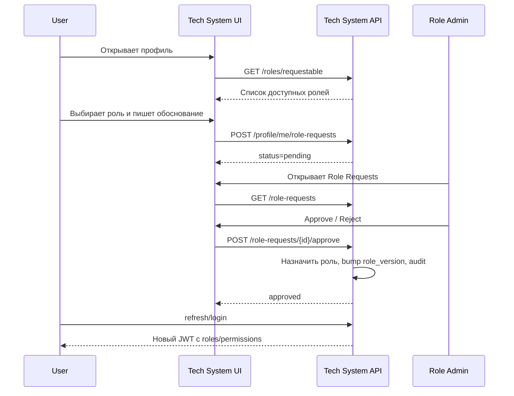
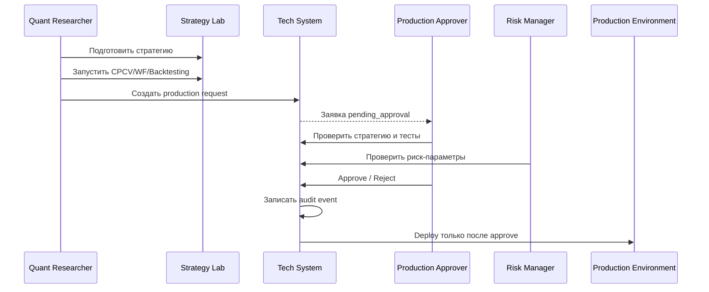

# Спецификация ролевой модели и подсистемы управления полномочиями ITS

**Продукт:** ITS — Intelligent Trading Strategies  
**Подсистема:** Tech System / Authorization / Role Management  
**Статус документа:** спецификация для разработки  
**Версия:** 1.0  
**Дата:** 2026-05-22

---

## 1. Назначение документа

Документ описывает требования к реализации ролевой модели, управления пользователями, ролями, полномочиями и заявками на получение ролей в платформе ITS.

Цель доработки — перевести ITS от исследовательско-лабораторной платформы к системе, пригодной для промышленной эксплуатации, включая будущую торговую эксплуатацию с реальными брокерскими токенами, разделением paper/live-контуров, аудитом действий и управляемым процессом вывода стратегий в production.

Спецификация охватывает:

- модель доступа и терминологию;
- роли пользователей и их права;
- permission model;
- структуру JWT claims;
- backend API;
- структуру БД;
- UI в Tech System;
- поведение UI при отсутствии прав;
- workflow запроса и выдачи ролей;
- workflow выгрузки стратегии в production;
- требования к секретам и брокерским токенам;
- требования к аудиту;
- план реализации и критерии готовности.

---

## 2. Исходный контекст системы

В ITS уже реализована базовая авторизация в подсистеме `tech_system`:

- `tech-system-backend` — FastAPI backend с REST API `/api/tech/auth/*`;
- `tech-system-ui` — Vue UI, доступный через `/tech/auth/`;
- Launchpad защищен через проверку JWT;
- пользователи хранятся в PostgreSQL в таблице `auth_users`;
- `auth_users.id` используется как `sub` в JWT;
- пароли хранятся в виде Argon2-хэша;
- используется JWT на базе `PyJWT`;
- алгоритм подписи — `HS256`;
- выпускаются `access_token` и `refresh_token`;
- в `auth_users` уже есть поле `role_version` как задел под будущую ролевую модель;
- в JWT уже предусмотрен claim `role_version`;
- текущие endpoints авторизации: register, login, refresh, me, logout.

Текущая система ITS содержит следующие пользовательские и backend-подсистемы:

- Launchpad;
- Data Hub;
- Strategy Lab;
- GA Lab;
- Tech System;
- Data Backend;
- Strategy Backend;
- GA Backend;
- nginx gateway.

Целевая ролевая модель должна покрывать не только исследовательские функции, но и будущую промышленную торговую эксплуатацию.

---

## 3. Ключевые решения

### 3.1. Основной подход к авторизации

Для ITS принимается гибридная модель:

```text
RBAC + Permission Scopes + контекстные ограничения
```

Где:

- **RBAC** — пользователь получает роли;
- **Permission Scopes** — каждая роль раскрывается в набор конкретных прав;
- **контекстные ограничения** — отдельные права применяются с учетом среды, например `paper` или `live`, а также уровня риска действия.

Это не чистый ABAC. Полноценный ABAC на текущем этапе избыточен. Но модель должна быть расширяемой, чтобы в будущем добавить контекстные условия: торговый счет, рынок, лимит, среда, тип стратегии, уровень риска, временное окно, IP-ограничения.

### 3.2. JWT как носитель ролей и полномочий

Принято решение передавать роли и permissions через JWT, чтобы бизнес-сервисы не делали лишние server-side вызовы в БД или authorization service при каждом запросе.

JWT должен использоваться не только как identity-token, но и как authorization-token.

Backend-сервисы должны проверять:

- подпись JWT;
- `iss`;
- `typ`;
- `exp`;
- `nbf`;
- `sub`;
- `roles`;
- `permissions`;
- при необходимости `env_scopes`.

### 3.3. Ограничение принятого JWT-подхода

Так как роли и permissions передаются в JWT, изменение ролей пользователя не может мгновенно повлиять на уже выданный access token без дополнительной проверки server-side.

Принятое поведение:

- изменение ролей увеличивает `auth_users.role_version`;
- новые claims попадают в access token при следующем login или refresh;
- уже выданный access token остается действительным до `exp`;
- для production/live-прав рекомендуется короткий TTL access token;
- для критических операций допускается требовать fresh-token / повторное подтверждение действия.

Рекомендуемое значение для промышленного режима:

```dotenv
AUTH_ACCESS_TOKEN_TTL_MINUTES=10
AUTH_REFRESH_TOKEN_TTL_DAYS=1
```

Для demo/dev режима допустимо оставить 30 минут.

---

## 4. Термины

| Термин | Значение |
|---|---|
| User | Учетная запись пользователя ITS. |
| Role | Именованный набор полномочий: `quant_researcher`, `system_admin`, `risk_manager` и т.д. |
| Permission | Атомарное право на действие: `strategy.test.run`, `ga.run.create`, `production.strategy.approve`. |
| Role Assignment | Назначение роли пользователю. |
| Role Request | Заявка пользователя на получение роли или полномочия. |
| Role Admin | Пользователь, который рассматривает заявки и назначает роли. |
| System Owner | Владелец политики доступа и предустановленных ролей. |
| Paper контур | Контур тестовой торговли / симуляции / paper trading без реальных сделок. |
| Live контур | Контур реальной торговли через брокера. |
| Production export | Перевод стратегии из исследовательского/лабораторного состояния в production-контур. |
| Secret | Брокерский токен или иной чувствительный секрет. |
| Secret reference | Ссылка на секрет без возможности прочитать его значение пользователем. |
| Audit event | Запись о значимом действии пользователя или системы. |

---

## 5. Принципы ролевой модели

### 5.1. Deny by default

Если у пользователя нет явно назначенного permission, действие запрещено.

### 5.2. Backend enforcement

UI может скрывать или блокировать элементы, но окончательное решение принимает backend.

Нельзя полагаться только на frontend.

### 5.3. Least privilege

Роль должна содержать минимально достаточный набор прав.

### 5.4. Separation of duties

Критические действия должны быть разделены:

- исследователь может разработать и протестировать стратегию;
- тот же исследователь может запустить GA и материализовать кандидатов;
- но выгрузка стратегии в production требует отдельного согласования;
- live-токены не должны быть доступны на чтение пользователям;
- администратор ролей управляет полномочиями, но не обязан иметь право запускать live-торговлю.

### 5.5. Immutability для рыночных данных

Пользователь может загружать рыночные данные, но не должен изменять уже загруженные данные.

Разрешены:

- загрузка нового набора данных;
- повторная загрузка как новая версия;
- деактивация / скрытие ошибочной версии администратором;
- аудит всех операций загрузки.

Не разрешены:

- ручное редактирование исторических котировок;
- незаметная перезапись данных без версии;
- удаление без следа.

### 5.6. Paper/live separation

Права на paper-операции и live-операции должны быть раздельными.

Пользователь, который может запускать paper trading, не должен автоматически получать право на live trading.

### 5.7. Secret isolation

В demo-режиме допустимо хранение токенов в `.env`.

В production-режиме брокерские токены должны храниться в secret vault. Пользователь не должен иметь возможность прочитать значение токена через UI или API.

---

## 6. Ответственность за предоставление полномочий

### 6.1. System Owner

System Owner отвечает за:

- утверждение политики доступа;
- утверждение состава предустановленных ролей;
- назначение пользователей, которым можно администрировать роли;
- определение перечня критических permissions;
- определение правил вывода стратегий в production.

System Owner — это владелец правил, но не обязательно ежедневный исполнитель заявок.

### 6.2. Role Admin / Security Admin

Role Admin отвечает за операционное управление полномочиями:

- просмотр пользователей;
- просмотр заявок на роли;
- одобрение или отклонение заявок;
- назначение ролей пользователям;
- отзыв ролей;
- указание причины решения;
- контроль истории изменений.

### 6.3. Production Approver

Production Approver отвечает за согласование вывода стратегии в production.

Это может быть отдельная роль или дополнительное право у Risk Manager / System Owner.

### 6.4. Risk Manager

Risk Manager отвечает за:

- контроль лимитов;
- проверку risk-параметров стратегии;
- согласование live-запуска;
- остановку production-стратегии при реализации риска.

---

## 7. Целевые роли

### 7.1. `viewer`

Роль только для просмотра.

Назначение:

- просмотр доступных разделов;
- чтение открытых отчетов;
- просмотр документации;
- без запуска расчетов и изменения данных.

### 7.2. `quant_researcher`

Единая роль для финансового модельера / Strategy Researcher / Quant Researcher.

Важно: финансовый модельер и квант-исследователь в ITS считаются одной практической ролью и должны иметь одинаковые права.

Назначение:

- работа с гипотезами;
- создание компонентов стратегии на Python;
- запуск CPCV, WalkForward, Backtesting;
- запуск GA;
- материализация GA-кандидатов;
- сравнение стратегий;
- подготовка стратегии к заявке на production export.

Эта роль должна иметь право создавать компоненты, потому что в ITS именно исследователи и кванты умеют писать Python-компоненты: селекторы, сигналы, аллокаторы, источники данных и трансформаторы.

Отдельная роль `component_developer` на текущем этапе не выделяется.

### 7.3. `data_manager`

Роль для управления загрузкой данных.

Назначение:

- загрузка новых рыночных данных;
- загрузка справочников;
- загрузка дивидендов;
- загрузка альтернативных источников;
- просмотр статуса загрузки;
- деактивация ошибочных версий при наличии отдельного permission.

Важно: custom bars не выделяются как отдельный привилегированный объект. Это один из видов данных / трансформатор над котировками.

### 7.4. `strategy_releaser`

Роль для подготовки релиза стратегии.

Назначение:

- создание заявки на выгрузку стратегии в production;
- прикрепление результатов тестов;
- указание параметров production-контура;
- передача заявки на согласование.

Эта роль не означает право самостоятельно утверждать production export.

### 7.5. `production_approver`

Роль для утверждения выгрузки стратегии в production.

Назначение:

- просмотр заявок на production export;
- проверка состава стратегии;
- проверка результатов CPCV, WalkForward, Backtesting;
- проверка параметров paper/live;
- утверждение или отклонение заявки.

### 7.6. `trading_operator`

Роль оператора торгового контура.

Назначение:

- запуск paper trading;
- запуск approved live strategy;
- остановка торговой стратегии;
- мониторинг runtime-состояния;
- просмотр ордеров и сделок;
- без права читать broker secrets.

### 7.7. `risk_manager`

Роль риск-менеджера.

Назначение:

- просмотр риск-параметров;
- настройка лимитов;
- согласование live-параметров;
- emergency stop;
- блокировка стратегии или торгового контура;
- просмотр audit trail по торговым действиям.

### 7.8. `secret_manager`

Роль администратора секретов.

Назначение:

- создание secret reference;
- обновление брокерского токена;
- ротация токена;
- проверка доступности секрета;
- удаление/деактивация secret reference.

Важно: даже `secret_manager` не должен читать значение секрета после сохранения. Он может только записать/заменить/удалить секрет.

### 7.9. `role_admin`

Роль администратора ролей.

Назначение:

- управление пользователями;
- назначение ролей;
- отзыв ролей;
- обработка заявок;
- просмотр permissions;
- просмотр audit log по управлению доступом.

### 7.10. `system_admin`

Технический администратор системы.

Назначение:

- управление техническим состоянием ITS;
- просмотр health-checks;
- просмотр системных настроек;
- управление конфигурацией подсистем;
- доступ к техническим журналам;
- управление интеграциями.

System Admin не должен автоматически получать права на утверждение production export или чтение брокерских секретов.

### 7.11. `auditor`

Роль аудитора.

Назначение:

- просмотр audit log;
- просмотр истории заявок;
- просмотр истории назначений ролей;
- просмотр истории production export;
- без права изменять данные.

---

## 8. Permission namespace

Permissions должны быть строковыми и стабильными.

Формат:

```text
<domain>.<resource>.<action>
```

Примеры:

```text
data.prices.read
strategy.test.run
ga.run.create
production.strategy.approve
role.request.approve
```

---

## 9. Каталог permissions

### 9.1. Общие permissions

| Permission | Описание |
|---|---|
| `app.launchpad.read` | Доступ к Launchpad. |
| `app.docs.read` | Просмотр документации. |
| `profile.self.read` | Просмотр своего профиля. |
| `profile.self.update` | Обновление допустимых полей своего профиля. |

### 9.2. Data Hub

| Permission | Описание |
|---|---|
| `data.sources.read` | Просмотр источников данных. |
| `data.instruments.read` | Просмотр инструментов. |
| `data.prices.read` | Просмотр котировок. |
| `data.dividends.read` | Просмотр дивидендов. |
| `data.custom_bars.read` | Просмотр производных баров. |
| `data.upload.create` | Загрузка нового набора данных. |
| `data.upload.read` | Просмотр истории загрузок. |
| `data.version.deactivate` | Деактивация ошибочной версии данных. |
| `data.source.create` | Добавление нового источника данных. |
| `data.source.update` | Обновление конфигурации источника данных. |

### 9.3. Strategy Lab

| Permission | Описание |
|---|---|
| `strategy.component.read` | Просмотр компонентов. |
| `strategy.component.create` | Создание компонента. |
| `strategy.component.update` | Обновление компонента. |
| `strategy.component.delete` | Удаление компонента из реестра. |
| `strategy.model.read` | Просмотр моделей. |
| `strategy.model.create` | Создание модели. |
| `strategy.model.update` | Обновление модели. |
| `strategy.model.delete` | Удаление модели. |
| `strategy.test.run` | Запуск CPCV / WalkForward / Backtesting. |
| `strategy.test.read` | Просмотр результатов тестов. |
| `strategy.compare.read` | Сравнение стратегий. |
| `strategy.production.request` | Создание заявки на выгрузку стратегии в production. |

### 9.4. GA Lab

| Permission | Описание |
|---|---|
| `ga.alphabet.read` | Просмотр алфавитов GA. |
| `ga.alphabet.update` | Обновление алфавитов GA. |
| `ga.run.create` | Запуск GA. |
| `ga.run.read` | Просмотр результатов GA. |
| `ga.run.cancel` | Остановка GA-запуска. |
| `ga.candidate.materialize` | Материализация GA-кандидата в стратегию. |

Принятое правило: материализовать GA-кандидата может тот же пользователь, который имеет право запускать GA.

### 9.5. Production / Trading

| Permission | Описание |
|---|---|
| `production.strategy.request` | Создание заявки на production export. |
| `production.strategy.read` | Просмотр production-стратегий. |
| `production.strategy.approve` | Утверждение выгрузки стратегии в production. |
| `production.strategy.reject` | Отклонение заявки на production export. |
| `production.strategy.deploy` | Техническое размещение approved стратегии в production. |
| `production.strategy.disable` | Отключение production-стратегии. |
| `trading.paper.start` | Запуск paper trading. |
| `trading.paper.stop` | Остановка paper trading. |
| `trading.live.start` | Запуск live trading. |
| `trading.live.stop` | Остановка live trading. |
| `trading.orders.read` | Просмотр ордеров. |
| `trading.trades.read` | Просмотр сделок. |
| `trading.positions.read` | Просмотр позиций. |
| `trading.emergency_stop` | Аварийная остановка торгового контура. |

### 9.6. Risk Management

| Permission | Описание |
|---|---|
| `risk.limits.read` | Просмотр лимитов. |
| `risk.limits.update` | Изменение лимитов. |
| `risk.events.read` | Просмотр риск-событий. |
| `risk.strategy.approve` | Риск-согласование стратегии. |
| `risk.strategy.block` | Блокировка стратегии по риску. |

### 9.7. Secrets / Broker Tokens

| Permission | Описание |
|---|---|
| `secret.reference.read` | Просмотр secret references без значения секрета. |
| `secret.reference.create` | Создание secret reference. |
| `secret.reference.update` | Обновление secret reference. |
| `secret.reference.delete` | Удаление или деактивация secret reference. |
| `secret.reference.rotate` | Ротация секрета. |
| `broker.account.read` | Просмотр брокерских аккаунтов. |
| `broker.account.create` | Создание брокерского аккаунта. |
| `broker.account.update` | Обновление брокерского аккаунта. |

Не создавать permission вида `secret.value.read`. Чтение значения секрета пользователем запрещено архитектурно.

### 9.8. Users / Roles / Permissions

| Permission | Описание |
|---|---|
| `user.read` | Просмотр пользователей. |
| `user.update` | Обновление пользователя. |
| `user.block` | Блокировка пользователя. |
| `role.read` | Просмотр ролей. |
| `role.create` | Создание роли. |
| `role.update` | Обновление роли. |
| `role.delete` | Удаление роли. |
| `role.assign` | Назначение роли пользователю. |
| `role.revoke` | Отзыв роли у пользователя. |
| `role.request.create` | Запрос роли пользователем. |
| `role.request.read` | Просмотр заявок на роли. |
| `role.request.approve` | Одобрение заявки на роль. |
| `role.request.reject` | Отклонение заявки на роль. |
| `permission.read` | Просмотр permissions. |

### 9.9. Audit

| Permission | Описание |
|---|---|
| `audit.auth.read` | Просмотр событий авторизации. |
| `audit.role.read` | Просмотр изменений ролей. |
| `audit.production.read` | Просмотр production-событий. |
| `audit.trading.read` | Просмотр торговых событий. |
| `audit.secret.read` | Просмотр событий работы с secret references. |

---

## 10. Матрица ролей

### 10.1. Сводная матрица

| Роль | Основные permissions |
|---|---|
| `viewer` | `app.launchpad.read`, `app.docs.read`, `profile.self.read`, `data.*.read`, `strategy.model.read`, `strategy.test.read`, `strategy.compare.read`, `ga.run.read` |
| `quant_researcher` | Права viewer + `strategy.component.create/update`, `strategy.model.create/update`, `strategy.test.run`, `ga.run.create/read/cancel`, `ga.candidate.materialize`, `strategy.production.request` |
| `data_manager` | Права чтения Data Hub + `data.upload.create/read`, `data.version.deactivate`, `data.source.create/update` |
| `strategy_releaser` | `strategy.production.request`, `production.strategy.request`, `production.strategy.read` |
| `production_approver` | `production.strategy.read`, `production.strategy.approve`, `production.strategy.reject` |
| `trading_operator` | `production.strategy.read`, `trading.paper.start/stop`, `trading.live.start/stop`, `trading.orders.read`, `trading.trades.read`, `trading.positions.read` |
| `risk_manager` | `risk.*`, `trading.emergency_stop`, `production.strategy.read`, `production.strategy.reject`, `audit.trading.read` |
| `secret_manager` | `secret.reference.*`, `broker.account.*`, `audit.secret.read` |
| `role_admin` | `user.read/update/block`, `role.*`, `role.request.*`, `permission.read`, `audit.role.read` |
| `system_admin` | health/config/system permissions, user read, audit technical read, deployment support; без автоматического права на live trading и production approval |
| `auditor` | `audit.*.read`, read-only доступ к users/roles/production requests |

### 10.2. Wildcards

В БД можно хранить конкретные permissions. Wildcard-представление (`data.*.read`) допустимо использовать только в документации и seed-конфигурации.

В runtime желательно раскрывать wildcard в конкретные permissions, чтобы проверка была простой и предсказуемой.

---

## 11. JWT claims

### 11.1. Access token payload

Пример access token payload:

```json
{
  "iss": "its-tech-system",
  "sub": "4b5ff8cb-321d-45b2-a6df-8f5d52b73544",
  "email": "user@example.com",
  "typ": "access",
  "iat": 1779460800,
  "nbf": 1779460800,
  "exp": 1779461400,
  "role_version": 3,
  "roles": [
    "quant_researcher"
  ],
  "permissions": [
    "app.launchpad.read",
    "profile.self.read",
    "data.sources.read",
    "data.instruments.read",
    "data.prices.read",
    "data.dividends.read",
    "strategy.component.read",
    "strategy.component.create",
    "strategy.model.read",
    "strategy.model.create",
    "strategy.test.run",
    "strategy.test.read",
    "strategy.compare.read",
    "ga.alphabet.read",
    "ga.run.create",
    "ga.run.read",
    "ga.run.cancel",
    "ga.candidate.materialize",
    "strategy.production.request"
  ],
  "env_scopes": [
    "research",
    "paper"
  ]
}
```

### 11.2. Refresh token payload

Refresh token не должен содержать полный список permissions.

Пример:

```json
{
  "iss": "its-tech-system",
  "sub": "4b5ff8cb-321d-45b2-a6df-8f5d52b73544",
  "email": "user@example.com",
  "typ": "refresh",
  "iat": 1779460800,
  "nbf": 1779460800,
  "exp": 1780065600,
  "role_version": 3
}
```

При refresh backend читает текущие роли пользователя из БД, формирует актуальный набор `roles` и `permissions`, выпускает новый access token.

### 11.3. Что нельзя включать в JWT

Запрещено включать в JWT:

- брокерские токены;
- API keys;
- secret values;
- пароли;
- Argon2 hash;
- чувствительные настройки брокерского счета;
- персональные данные, не нужные для авторизации.

---

## 12. Backend enforcement

### 12.1. Общий механизм

Во всех backend-сервисах должен быть единый механизм проверки JWT.

Рекомендуемые dependency-функции:

```python
get_current_user()
require_permissions(*permissions: str)
require_any_permission(*permissions: str)
require_roles(*roles: str)
require_any_role(*roles: str)
```

### 12.2. Проверка permission

Алгоритм:

1. Получить `Authorization: Bearer <token>`.
2. Проверить подпись JWT через `AUTH_JWT_SECRET_KEY` и `AUTH_JWT_ALGORITHM`.
3. Проверить `iss`, `typ`, `exp`, `nbf`.
4. Извлечь `sub`, `email`, `roles`, `permissions`.
5. Проверить наличие требуемого permission.
6. При отсутствии права вернуть `403 Forbidden`.

### 12.3. Ошибки

#### 401 Unauthorized

Использовать, если:

- токен отсутствует;
- токен невалиден;
- токен истек;
- неверная подпись;
- неверный `typ`.

Пример:

```json
{
  "error": "unauthorized",
  "message": "Authentication token is missing or invalid."
}
```

#### 403 Forbidden

Использовать, если пользователь аутентифицирован, но не имеет права.

Пример:

```json
{
  "error": "forbidden",
  "message": "You do not have permission to run GA jobs.",
  "required_permissions": ["ga.run.create"],
  "requestable_roles": ["quant_researcher"]
}
```

---

## 13. Структура БД

### 13.1. Существующая таблица `auth_users`

Используется существующая таблица:

```text
auth_users
```

Существующие поля:

- `id`;
- `email`;
- `password_hash`;
- `is_active`;
- `is_verified`;
- `role_version`;
- `created_at`;
- `updated_at`;
- `last_login_at`.

### 13.2. `auth_roles`

```sql
CREATE TABLE auth_roles (
    id UUID PRIMARY KEY,
    code VARCHAR(128) NOT NULL UNIQUE,
    title VARCHAR(255) NOT NULL,
    description TEXT NULL,
    is_system BOOLEAN NOT NULL DEFAULT FALSE,
    is_assignable BOOLEAN NOT NULL DEFAULT TRUE,
    created_at TIMESTAMPTZ NOT NULL,
    updated_at TIMESTAMPTZ NOT NULL
);
```

### 13.3. `auth_permissions`

```sql
CREATE TABLE auth_permissions (
    id UUID PRIMARY KEY,
    code VARCHAR(255) NOT NULL UNIQUE,
    domain VARCHAR(64) NOT NULL,
    resource VARCHAR(128) NOT NULL,
    action VARCHAR(64) NOT NULL,
    title VARCHAR(255) NOT NULL,
    description TEXT NULL,
    is_critical BOOLEAN NOT NULL DEFAULT FALSE,
    created_at TIMESTAMPTZ NOT NULL,
    updated_at TIMESTAMPTZ NOT NULL
);
```

### 13.4. `auth_role_permissions`

```sql
CREATE TABLE auth_role_permissions (
    role_id UUID NOT NULL REFERENCES auth_roles(id) ON DELETE CASCADE,
    permission_id UUID NOT NULL REFERENCES auth_permissions(id) ON DELETE CASCADE,
    created_at TIMESTAMPTZ NOT NULL,
    PRIMARY KEY (role_id, permission_id)
);
```

### 13.5. `auth_user_roles`

```sql
CREATE TABLE auth_user_roles (
    user_id UUID NOT NULL REFERENCES auth_users(id) ON DELETE CASCADE,
    role_id UUID NOT NULL REFERENCES auth_roles(id) ON DELETE CASCADE,
    assigned_by UUID NULL REFERENCES auth_users(id),
    assigned_at TIMESTAMPTZ NOT NULL,
    expires_at TIMESTAMPTZ NULL,
    reason TEXT NULL,
    PRIMARY KEY (user_id, role_id)
);
```

### 13.6. `auth_role_requests`

```sql
CREATE TABLE auth_role_requests (
    id UUID PRIMARY KEY,
    requester_id UUID NOT NULL REFERENCES auth_users(id) ON DELETE CASCADE,
    requested_role_id UUID NOT NULL REFERENCES auth_roles(id),
    status VARCHAR(32) NOT NULL,
    justification TEXT NOT NULL,
    decision_comment TEXT NULL,
    decided_by UUID NULL REFERENCES auth_users(id),
    decided_at TIMESTAMPTZ NULL,
    created_at TIMESTAMPTZ NOT NULL,
    updated_at TIMESTAMPTZ NOT NULL
);
```

Допустимые статусы:

- `pending`;
- `approved`;
- `rejected`;
- `cancelled`.

### 13.7. `auth_audit_log`

```sql
CREATE TABLE auth_audit_log (
    id UUID PRIMARY KEY,
    actor_user_id UUID NULL REFERENCES auth_users(id),
    action VARCHAR(255) NOT NULL,
    object_type VARCHAR(128) NOT NULL,
    object_id VARCHAR(255) NULL,
    before_json JSONB NULL,
    after_json JSONB NULL,
    ip_address VARCHAR(64) NULL,
    user_agent TEXT NULL,
    created_at TIMESTAMPTZ NOT NULL
);
```

### 13.8. `production_strategy_requests`

```sql
CREATE TABLE production_strategy_requests (
    id UUID PRIMARY KEY,
    strategy_code VARCHAR(255) NOT NULL,
    strategy_name VARCHAR(255) NOT NULL,
    requester_id UUID NOT NULL REFERENCES auth_users(id),
    status VARCHAR(32) NOT NULL,
    target_environment VARCHAR(32) NOT NULL,
    test_summary_json JSONB NOT NULL,
    risk_summary_json JSONB NULL,
    production_params_json JSONB NULL,
    requested_at TIMESTAMPTZ NOT NULL,
    decided_by UUID NULL REFERENCES auth_users(id),
    decided_at TIMESTAMPTZ NULL,
    decision_comment TEXT NULL,
    created_at TIMESTAMPTZ NOT NULL,
    updated_at TIMESTAMPTZ NOT NULL
);
```

Допустимые статусы:

- `draft`;
- `pending_approval`;
- `approved`;
- `rejected`;
- `deployed`;
- `disabled`.

### 13.9. `secret_references`

```sql
CREATE TABLE secret_references (
    id UUID PRIMARY KEY,
    code VARCHAR(255) NOT NULL UNIQUE,
    title VARCHAR(255) NOT NULL,
    provider VARCHAR(128) NOT NULL,
    environment VARCHAR(32) NOT NULL,
    vault_path VARCHAR(512) NOT NULL,
    status VARCHAR(32) NOT NULL,
    created_by UUID NULL REFERENCES auth_users(id),
    created_at TIMESTAMPTZ NOT NULL,
    updated_at TIMESTAMPTZ NOT NULL,
    rotated_at TIMESTAMPTZ NULL
);
```

В БД хранится только ссылка на секрет, а не значение секрета.

---

## 14. Seed-данные

При первой миграции нужно создать:

1. Базовый каталог permissions.
2. Базовые роли.
3. Связи role-permission.
4. Первого администратора.

### 14.1. Первый администратор

Варианты:

#### Вариант A — через env

```dotenv
ITS_BOOTSTRAP_ADMIN_EMAIL=admin@example.com
```

При старте или миграции пользователь с этим email получает роль `system_admin` и `role_admin`.

#### Вариант B — через CLI

```bash
poetry run its-tech create-admin admin@example.com
```

Рекомендуется реализовать оба варианта.

---

## 15. API Tech System

Базовый публичный путь:

```text
/api/tech
```

### 15.1. Auth API

Существующие endpoints сохраняются:

| Method | Endpoint | Permission | Описание |
|---|---|---|---|
| `POST` | `/auth/register` | public | Регистрация. |
| `POST` | `/auth/login` | public | Вход. |
| `POST` | `/auth/refresh` | refresh token | Обновление пары токенов. |
| `GET` | `/auth/me` | authenticated | Текущий пользователь. |
| `POST` | `/auth/logout` | authenticated | Logout на стороне клиента. |

`GET /auth/me` должен вернуть роли и permissions пользователя.

Пример ответа:

```json
{
  "id": "4b5ff8cb-321d-45b2-a6df-8f5d52b73544",
  "email": "user@example.com",
  "is_active": true,
  "is_verified": false,
  "role_version": 3,
  "roles": [
    {
      "code": "quant_researcher",
      "title": "Quant Researcher"
    }
  ],
  "permissions": [
    "strategy.test.run",
    "ga.run.create"
  ]
}
```

### 15.2. Profile API

| Method | Endpoint | Permission | Описание |
|---|---|---|---|
| `GET` | `/profile/me` | `profile.self.read` | Профиль текущего пользователя. |
| `GET` | `/profile/me/roles` | `profile.self.read` | Назначенные роли. |
| `GET` | `/profile/me/permissions` | `profile.self.read` | Эффективные permissions. |
| `GET` | `/profile/me/role-requests` | `role.request.create` | Мои заявки. |
| `POST` | `/profile/me/role-requests` | `role.request.create` | Запросить роль. |
| `POST` | `/profile/me/role-requests/{id}/cancel` | owner | Отменить свою pending-заявку. |

### 15.3. Role Catalog API

| Method | Endpoint | Permission | Описание |
|---|---|---|---|
| `GET` | `/roles` | `role.read` или authenticated для requestable roles | Список ролей. |
| `GET` | `/roles/requestable` | authenticated | Список ролей, которые можно запросить. |
| `GET` | `/roles/{code}` | `role.read` | Детали роли. |
| `POST` | `/roles` | `role.create` | Создать роль. |
| `PATCH` | `/roles/{code}` | `role.update` | Изменить роль. |
| `DELETE` | `/roles/{code}` | `role.delete` | Удалить роль. |

### 15.4. Permission API

| Method | Endpoint | Permission | Описание |
|---|---|---|---|
| `GET` | `/permissions` | `permission.read` | Список permissions. |
| `GET` | `/permissions/grouped` | `permission.read` | Permissions по доменам. |

### 15.5. User Management API

| Method | Endpoint | Permission | Описание |
|---|---|---|---|
| `GET` | `/users` | `user.read` | Список пользователей. |
| `GET` | `/users/{id}` | `user.read` | Карточка пользователя. |
| `PATCH` | `/users/{id}` | `user.update` | Изменить пользователя. |
| `POST` | `/users/{id}/block` | `user.block` | Заблокировать пользователя. |
| `POST` | `/users/{id}/unblock` | `user.block` | Разблокировать пользователя. |
| `POST` | `/users/{id}/roles` | `role.assign` | Назначить роль. |
| `DELETE` | `/users/{id}/roles/{role_code}` | `role.revoke` | Отозвать роль. |

При назначении или отзыве роли:

- обновить `auth_user_roles`;
- увеличить `auth_users.role_version`;
- записать `auth_audit_log`;
- вернуть пользователю рекомендацию обновить сессию.

### 15.6. Role Request Admin API

| Method | Endpoint | Permission | Описание |
|---|---|---|---|
| `GET` | `/role-requests` | `role.request.read` | Все заявки. |
| `GET` | `/role-requests/{id}` | `role.request.read` | Детали заявки. |
| `POST` | `/role-requests/{id}/approve` | `role.request.approve` | Одобрить заявку. |
| `POST` | `/role-requests/{id}/reject` | `role.request.reject` | Отклонить заявку. |

При approve:

- проверить, что заявка `pending`;
- назначить роль пользователю;
- увеличить `role_version`;
- записать audit event;
- изменить статус на `approved`.

### 15.7. Production Strategy Request API

| Method | Endpoint | Permission | Описание |
|---|---|---|---|
| `POST` | `/production/strategy-requests` | `production.strategy.request` | Создать заявку на production export. |
| `GET` | `/production/strategy-requests` | `production.strategy.read` | Список заявок. |
| `GET` | `/production/strategy-requests/{id}` | `production.strategy.read` | Детали заявки. |
| `POST` | `/production/strategy-requests/{id}/approve` | `production.strategy.approve` | Одобрить. |
| `POST` | `/production/strategy-requests/{id}/reject` | `production.strategy.reject` | Отклонить. |
| `POST` | `/production/strategy-requests/{id}/deploy` | `production.strategy.deploy` | Развернуть approved-стратегию. |

### 15.8. Audit API

| Method | Endpoint | Permission | Описание |
|---|---|---|---|
| `GET` | `/audit/auth` | `audit.auth.read` | События авторизации. |
| `GET` | `/audit/roles` | `audit.role.read` | Изменения ролей. |
| `GET` | `/audit/production` | `audit.production.read` | Production-события. |
| `GET` | `/audit/secrets` | `audit.secret.read` | Secret reference события. |
| `GET` | `/audit/trading` | `audit.trading.read` | Торговые события. |

---

## 16. Интеграция с Data Backend, Strategy Backend, GA Backend

### 16.1. Общие требования

Каждый backend-сервис должен:

- принимать JWT через `Authorization: Bearer`;
- валидировать JWT локально;
- проверять permissions на endpoint-level;
- не доверять только UI;
- возвращать 401/403 в едином формате;
- писать audit events для критических операций.

### 16.2. Data Backend permissions

Примеры:

| Endpoint | Permission |
|---|---|
| `GET /api/data/sources` | `data.sources.read` |
| `GET /api/data/stocks` | `data.instruments.read` |
| `GET /api/data/currencies` | `data.instruments.read` |
| `GET /api/data/prices` | `data.prices.read` |
| `GET /api/data/dividends` | `data.dividends.read` |
| `GET /api/data/custom-gold-bars` | `data.custom_bars.read` |
| `POST /api/data/uploads` | `data.upload.create` |

### 16.3. Strategy Backend permissions

| Endpoint | Permission |
|---|---|
| list components | `strategy.component.read` |
| create/update component | `strategy.component.create` / `strategy.component.update` |
| list models | `strategy.model.read` |
| run CPCV/WF/Backtesting | `strategy.test.run` |
| read test results | `strategy.test.read` |
| compare models | `strategy.compare.read` |
| create production request | `strategy.production.request` |

### 16.4. GA Backend permissions

| Endpoint | Permission |
|---|---|
| read alphabets | `ga.alphabet.read` |
| start GA | `ga.run.create` |
| read GA status/results | `ga.run.read` |
| cancel GA | `ga.run.cancel` |
| materialize top candidates | `ga.candidate.materialize` |

---

## 17. UI-спецификация

## 17.1. Общая навигация

В Launchpad и верхней панели ITS добавить:

- текущий пользователь;
- текущие роли;
- переход в профиль;
- переход в Tech System для пользователей с правами администрирования;
- logout.

### 17.2. Профиль пользователя `/tech/profile/`

Профиль должен показывать:

- email;
- user id;
- статус пользователя;
- дату регистрации;
- последний вход;
- назначенные роли;
- эффективные permissions;
- заявки на роли;
- кнопку «Запросить роль».

#### Блок «Мои роли»

Для каждой роли:

- код роли;
- название;
- описание;
- дата назначения;
- кем назначена;
- срок действия, если есть.

#### Блок «Мои permissions»

Группировать по доменам:

- Data Hub;
- Strategy Lab;
- GA Lab;
- Production;
- Trading;
- Risk;
- Tech System.

#### Блок «Запросить роль»

Пользователь выбирает роль из списка requestable roles.

Форма:

- роль;
- обоснование;
- кнопка отправки.

После отправки:

- статус `pending`;
- заявка отображается в профиле;
- администратор видит заявку в Tech System.

### 17.3. Tech System: управление ролями

В подсистему Tech System добавить раздел:

```text
Tech System -> Access Management
```

Подразделы:

1. Users.
2. Roles.
3. Permissions.
4. Role Requests.
5. Production Requests.
6. Audit Log.
7. Secrets & Broker Accounts.

### 17.4. Users UI

Таблица пользователей:

- email;
- статус;
- роли;
- role_version;
- last_login_at;
- actions.

Карточка пользователя:

- профиль;
- роли;
- effective permissions;
- история заявок;
- история изменений ролей;
- кнопки: назначить роль, отозвать роль, заблокировать.

### 17.5. Roles UI

Таблица ролей:

- code;
- title;
- description;
- число permissions;
- system/custom;
- assignable;
- actions.

Карточка роли:

- общая информация;
- список permissions;
- пользователи с этой ролью;
- история изменений.

### 17.6. Permissions UI

Read-only каталог permissions.

Группировка:

- App;
- Data;
- Strategy;
- GA;
- Production;
- Trading;
- Risk;
- Secrets;
- Users/Roles;
- Audit.

### 17.7. Role Requests UI

Таблица заявок:

- requester;
- requested role;
- status;
- justification;
- created_at;
- decided_by;
- actions.

Действия администратора:

- approve;
- reject;
- comment required.

При approve UI должен показать предупреждение:

```text
После одобрения роль будет назначена пользователю. Новые права попадут в JWT после обновления токена или повторного входа пользователя.
```

### 17.8. Production Requests UI

Таблица заявок на production export:

- strategy name;
- requester;
- target environment;
- status;
- created_at;
- test summary;
- risk summary;
- actions.

Карточка заявки:

- стратегия;
- состав pipeline;
- результаты CPCV;
- результаты WalkForward;
- результаты Backtesting;
- параметры risk-control;
- paper/live контур;
- брокерский аккаунт / secret reference;
- история решений.

Actions:

- approve;
- reject;
- deploy;
- disable.

### 17.9. Secrets & Broker Accounts UI

UI должен показывать только secret references.

Показывать:

- code;
- provider;
- environment;
- status;
- created_at;
- rotated_at;
- masked value indicator: `********`;
- actions: create/update/rotate/deactivate.

Не показывать:

- фактическое значение токена;
- полный vault path, если он раскрывает чувствительную информацию;
- секреты в логах браузера.

---

## 18. UI при отсутствии полномочий

Все UI должны явно показывать, что действие недоступно из-за отсутствия прав.

### 18.1. Правила отображения

1. Раздел без права чтения не должен открываться.
2. Кнопка действия без permission должна быть disabled.
3. Tooltip должен объяснять, какого права не хватает.
4. Если роль можно запросить, UI должен показать кнопку «Запросить доступ».
5. Если пользователь напрямую открыл URL, показывать страницу 403.

### 18.2. Пример disabled-кнопки

Текст tooltip:

```text
Недостаточно прав для запуска GA. Требуется permission: ga.run.create. Можно запросить роль Quant Researcher в профиле пользователя.
```

### 18.3. Страница 403

Страница должна содержать:

- заголовок: «Нет доступа»;
- описание действия;
- список требуемых permissions;
- список ролей, которые обычно дают это право;
- кнопку «Запросить роль»;
- кнопку «Вернуться назад».

Пример:

```text
Нет доступа к запуску WalkForward-теста.

Требуется permission: strategy.test.run.
Эта возможность обычно доступна роли Quant Researcher.
```

---

## 19. Workflow запроса роли



---

## 20. Workflow production export

Единственное действие, требующее обязательного согласования: выгрузка стратегии в production.



Минимальные условия для production request:

- стратегия зарегистрирована;
- есть результаты CPCV;
- есть результаты WalkForward;
- есть результаты Backtesting;
- указан target environment;
- для live указан broker account / secret reference;
- указаны лимиты и риск-параметры;
- пользователь имеет `production.strategy.request`.

---

## 21. Секреты и broker tokens

### 21.1. Demo/dev режим

В demo/dev режиме допустимо хранение токена в `.env`:

```dotenv
TINVEST_TOKEN=...
```

Это приемлемо только для локального запуска, демонстрации и исследовательской эксплуатации.

### 21.2. Production режим

В production режиме требуется secret vault.

Поддерживаемые варианты:

- HashiCorp Vault;
- cloud secret manager;
- self-hosted encrypted vault;
- другой совместимый secret storage.

### 21.3. Правила доступа к секретам

- Пользователь не читает значение секрета.
- UI не отображает значение секрета.
- API не возвращает значение секрета.
- В БД хранится только `secret_reference`.
- Runtime broker adapter получает секрет только в момент выполнения операции.
- Все обращения к secret reference пишутся в audit log.

### 21.4. Secret events для аудита

Записывать события:

- secret reference created;
- secret reference updated;
- secret rotated;
- secret deactivated;
- runtime secret used by service;
- failed secret access.

---

## 22. Аудит

### 22.1. События, обязательные для аудита

#### Auth

- login success;
- login failed;
- refresh;
- logout;
- user blocked;
- user unblocked.

#### Roles

- role created;
- role updated;
- role deleted;
- permission assigned to role;
- permission removed from role;
- role assigned to user;
- role revoked from user;
- role request created;
- role request approved;
- role request rejected.

#### Strategy / GA

- component created;
- model created;
- test run started;
- test run completed;
- GA run started;
- GA run cancelled;
- GA candidate materialized.

#### Production

- production request created;
- production request approved;
- production request rejected;
- strategy deployed;
- strategy disabled.

#### Trading

- paper trading started;
- paper trading stopped;
- live trading started;
- live trading stopped;
- emergency stop;
- order submitted;
- order rejected;
- order executed.

#### Secrets

- secret reference created;
- secret reference updated;
- secret rotated;
- secret deactivated;
- secret used by runtime service.

### 22.2. Audit payload

Минимальный audit event:

```json
{
  "actor_user_id": "...",
  "action": "role.request.approved",
  "object_type": "auth_role_request",
  "object_id": "...",
  "before_json": {},
  "after_json": {},
  "ip_address": "127.0.0.1",
  "user_agent": "...",
  "created_at": "2026-05-22T18:00:00Z"
}
```

---

## 23. Требования к безопасности

### 23.1. JWT

- Использовать HS256 на текущем этапе.
- `AUTH_JWT_SECRET_KEY` должен быть длинным случайным секретом.
- Production secret не должен совпадать с dev secret.
- Токен должен иметь `iss`, `sub`, `typ`, `iat`, `nbf`, `exp`.
- Access token должен быть короткоживущим.
- Refresh token не должен содержать полный список permissions.

### 23.2. Passwords

- Сохранять только Argon2 hash.
- Не возвращать hash в API.
- Не логировать пароль.

### 23.3. UI token storage

Текущий вариант — `localStorage`.

Для production желательно рассмотреть более безопасную схему хранения refresh token, например httpOnly secure cookie. Но это можно вынести в отдельную итерацию.

### 23.4. CORS / Gateway

- Ограничить CORS production-доменами.
- Не раскрывать internal service URLs наружу.
- Все внешние API идут через gateway.

### 23.5. Sensitive logs

Запрещено логировать:

- JWT полностью;
- refresh token;
- broker token;
- password;
- secret value.

---

## 24. Требования к реализации frontend permissions

### 24.1. Permission store

В `tech-system-ui` и остальных UI добавить общий frontend-механизм:

```ts
hasPermission(permission: string): boolean
hasAnyPermission(permissions: string[]): boolean
hasRole(role: string): boolean
```

Источник данных:

- access token claims;
- `/api/tech/auth/me`;
- состояние auth store.

### 24.2. Route guards

Для каждого UI route указать required permissions.

Пример:

```ts
{
  path: '/ga/',
  component: GALab,
  meta: {
    requiredPermissions: ['ga.run.read']
  }
}
```

### 24.3. Action guards

Для кнопок:

```vue
<Button
  :disabled="!can('ga.run.create')"
  :title="permissionTooltip('ga.run.create')"
>
  Запустить GA
</Button>
```

---

## 25. Требования к реализации backend permissions

### 25.1. Shared package

Создать общий пакет:

```text
its/authz
```

Состав:

```text
its/authz/jwt.py
its/authz/context.py
its/authz/dependencies.py
its/authz/permissions.py
its/authz/errors.py
```

### 25.2. Permission constants

Вынести permissions в constants:

```python
class Permissions:
    GA_RUN_CREATE = "ga.run.create"
    STRATEGY_TEST_RUN = "strategy.test.run"
    PRODUCTION_STRATEGY_APPROVE = "production.strategy.approve"
```

### 25.3. Пример endpoint protection

```python
@router.post("/runs")
async def create_ga_run(
    payload: GARunCreate,
    user: AuthContext = Depends(require_permissions(Permissions.GA_RUN_CREATE)),
):
    ...
```

---

## 26. План реализации

### Этап 1. База ролей и permissions

Задачи:

- создать SQLAlchemy-модели;
- создать Alembic migrations;
- добавить seed permissions;
- добавить seed roles;
- добавить role-permission связи;
- добавить bootstrap admin.

Definition of Done:

- миграции применяются на чистой БД;
- роли и permissions появляются после seed;
- bootstrap admin получает `system_admin` и `role_admin`;
- тесты БД проходят.

### Этап 2. JWT с roles/permissions

Задачи:

- изменить login/refresh;
- добавить roles и permissions в access token;
- refresh token оставить компактным;
- обновить `/auth/me`;
- добавить role_version bump при изменении ролей.

Definition of Done:

- login возвращает JWT с roles/permissions;
- refresh выпускает новый access token с актуальными ролями;
- `/auth/me` возвращает роли и permissions;
- старые пользователи без ролей корректно работают как минимальный viewer или no-role user.

### Этап 3. Backend authorization dependencies

Задачи:

- создать `its/authz`;
- реализовать проверку JWT;
- реализовать `require_permissions`;
- унифицировать ошибки 401/403;
- подключить проверки в Tech System.

Definition of Done:

- endpoint без токена возвращает 401;
- endpoint без права возвращает 403;
- endpoint с правом выполняется;
- тесты покрывают все сценарии.

### Этап 4. Role Requests

Задачи:

- реализовать таблицу заявок;
- реализовать API создания заявки;
- реализовать API approve/reject;
- добавить audit;
- bump role_version при approve.

Definition of Done:

- пользователь может запросить роль;
- role_admin видит заявку;
- role_admin может approve/reject;
- при approve роль назначается;
- событие записывается в audit log.

### Этап 5. Tech System UI

Задачи:

- обновить профиль пользователя;
- добавить список ролей;
- добавить список permissions;
- добавить форму запроса роли;
- добавить Access Management;
- добавить Users UI;
- добавить Roles UI;
- добавить Role Requests UI;
- добавить Audit UI.

Definition of Done:

- пользователь видит свои роли;
- пользователь может отправить заявку;
- администратор может обработать заявку;
- UI показывает отсутствие прав;
- disabled actions имеют понятные tooltip.

### Этап 6. Защита Data / Strategy / GA backend

Задачи:

- подключить shared authz в Data Backend;
- подключить shared authz в Strategy Backend;
- подключить shared authz в GA Backend;
- защитить ключевые endpoints;
- добавить audit для критических операций.

Definition of Done:

- запуск GA требует `ga.run.create`;
- материализация требует `ga.candidate.materialize`;
- запуск тестов требует `strategy.test.run`;
- загрузка данных требует `data.upload.create`;
- чтение работает только при read permissions.

### Этап 7. Production export workflow

Задачи:

- реализовать production request API;
- добавить UI заявок;
- добавить approve/reject;
- добавить audit;
- добавить интеграционную точку deploy.

Definition of Done:

- исследователь может создать заявку;
- approver может согласовать;
- без approve deploy невозможен;
- все решения пишутся в audit.

### Этап 8. Secret references

Задачи:

- реализовать secret reference model;
- для demo сохранить поддержку `.env`;
- для production добавить интерфейс vault adapter;
- добавить UI secret references;
- запретить чтение secret value;
- добавить audit.

Definition of Done:

- secret можно создать/обновить/ротировать;
- значение секрета не возвращается через API;
- runtime сервис может получить секрет через adapter;
- обращения пишутся в audit.

---

## 27. Тестирование

### 27.1. Unit tests

Покрыть:

- формирование JWT claims;
- проверку permissions;
- role-permission resolution;
- role_version bump;
- статусную модель role request;
- audit event writer.

### 27.2. Integration tests

Проверить:

- register -> login -> me;
- login с ролью;
- refresh после изменения роли;
- запрос роли;
- approve заявки;
- запрет доступа без permission;
- разрешение доступа с permission.

### 27.3. E2E UI tests

Проверить:

- пользователь видит профиль;
- пользователь видит свои роли;
- пользователь запрашивает роль;
- role_admin одобряет заявку;
- кнопка GA disabled без прав;
- кнопка GA enabled с правами;
- 403 page показывает требуемый permission.

### 27.4. Security tests

Проверить:

- backend не доверяет frontend;
- подмена JWT не проходит;
- JWT с неверным `typ` не проходит;
- истекший JWT не проходит;
- пользователь не может прочитать secret value;
- отсутствие permission всегда дает 403.

---

## 28. Критерии приемки

Ролевая модель считается реализованной, если:

1. В БД есть роли, permissions, связи и назначения пользователям.
2. Access token содержит roles и permissions.
3. Business backends проверяют permissions локально по JWT.
4. Пользователь видит роли и permissions в профиле.
5. Пользователь может запросить роль.
6. Role Admin может одобрить или отклонить заявку.
7. Все UI явно показывают отсутствие полномочий.
8. Data / Strategy / GA endpoints защищены permissions.
9. Запуск GA и материализация кандидата доступны Quant Researcher.
10. Загрузка данных разрешена, изменение исторических данных запрещено.
11. Production export требует отдельной заявки и согласования.
12. Broker tokens не читаются пользователями.
13. Demo mode поддерживает `.env`, production mode предусматривает secret vault.
14. Критические действия пишутся в audit log.
15. Есть тесты на 401/403, role request, JWT claims и role assignment.

---

## 29. Итоговая целевая модель

Целевая модель для ITS:

```text
Пользователь -> JWT -> roles -> permissions -> backend enforcement -> audit
```

Ключевая логика:

- роли и permissions передаются в JWT;
- backend-сервисы проверяют JWT локально;
- Tech System управляет пользователями, ролями, заявками и аудитом;
- Quant Researcher имеет права исследователя и разработчика компонентов;
- Component Developer отдельно не выделяется;
- custom bars рассматриваются как один из видов данных / трансформаторов;
- загрузка данных разрешена, ручное изменение данных запрещено;
- GA-кандидата материализует тот, кто имеет право запускать GA;
- production export требует согласования;
- live trading отделен от paper trading;
- брокерские токены изолированы через secret reference / vault;
- UI обязан явно показывать отсутствие полномочий и давать путь к запросу роли.
