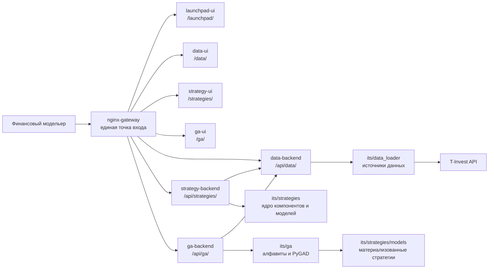

# Архитектура системы

[К оглавлению](README.md)

## Общий вид

ITS состоит из четырех пользовательских интерфейсов, трех backend-сервисов, Python-ядра моделей, подсистемы загрузки данных и GA-движка.



## Контейнеры Docker Compose

| Сервис | Путь | Назначение |
| --- | --- | --- |
| `nginx-gateway` | `infra/nginx` | маршрутизация UI, API и документации |
| `launchpad-ui` | `ui/launchpad-ui` | стартовый экран системы |
| `data-ui` | `ui/data-ui` | интерфейс данных |
| `strategy-ui` | `ui/strategy-ui` | интерфейс моделей и тестов |
| `ga-ui` | `its/ui/ga-ui` | интерфейс GA-генерации |
| `data-backend` | `services/data_backend` | API источников данных |
| `strategy-backend` | `services/strategy_backend` | API реестра моделей и тестов |
| `ga-backend` | `its/services/ga_backend` | API генетического алгоритма |

## Маршрутизация gateway

`nginx-gateway` открывает наружу один порт и маршрутизирует запросы:

| Внешний путь | Внутренний сервис |
| --- | --- |
| `/` | redirect на `/launchpad/` |
| `/launchpad/` | `launchpad-ui` |
| `/data/` | `data-ui` |
| `/strategies/` | `strategy-ui` |
| `/ga/` | `ga-ui` |
| `/docs/` | Markdown-документация из папки `docs` |
| `/api/data/` | `data-backend` |
| `/api/strategies/` | `strategy-backend` |
| `/api/ga/` | `ga-backend` |

## Backend-архитектура

### Data Backend

Путь:

```text
services/data_backend
```

Основные функции:

- health-check;
- список источников данных;
- справочник акций;
- справочник валют;
- загрузка свечей;
- построение custom gold bars;
- загрузка дивидендов;
- нормализация и кэширование ответов.

Data Backend использует код загрузчиков из:

```text
its/data_loader
```

### Strategy Backend

Путь:

```text
services/strategy_backend
```

Основные функции:

- реестр компонентов;
- реестр моделей ядра торговой стратегии;
- реестр полноценных торговых стратегий;
- детальная структура выбранной модели;
- запуск и чтение CPCV-тестов;
- запуск и чтение WalkForward-тестов;
- запуск и чтение Backtesting-тестов;
- сравнение стратегий по последним сохраненным тестам.

### GA Backend

Путь:

```text
its/services/ga_backend
```

Основные функции:

- чтение алфавитов генетического алгоритма;
- запуск GA-задачи в фоне;
- мониторинг статуса запуска;
- сохранение истории запусков;
- материализация TOP-N стратегий в Python-код.

## Frontend-архитектура

Все UI написаны на Vue 3, TypeScript и Vite.

| UI | Путь | Роль |
| --- | --- | --- |
| Launchpad | `ui/launchpad-ui` | плитки запуска подсистем |
| Data UI | `ui/data-ui` | работа с рыночными данными |
| Strategy UI | `ui/strategy-ui` | работа с моделями, тестами и сравнением |
| GA UI | `its/ui/ga-ui` | настройка и мониторинг генетического алгоритма |

Интерфейсы обращаются к API через gateway, поэтому пользователю не нужно знать внутренние адреса контейнеров.

## Кодовое ядро стратегий

Ключевые директории:

| Путь | Назначение |
| --- | --- |
| `its/strategies/core/selectors` | предварительная фильтрация активов |
| `its/strategies/core/signals` | сигнальные модели |
| `its/strategies/core/optimization` | аллокаторы портфеля |
| `its/strategies/core/types` | базовые типы и протоколы |
| `its/strategies/models` | готовые модели ядра торговой стратегии |
| `its/strategies_model/core` | полноценная торговая стратегия и политики выхода |
| `its/strategies_model/model` | собранные trading strategies |
| `its/strategies/testing` | CPCV, WalkForward, Backtesting, comparison |
| `its/ga/alphabets` | алфавиты генов для GA |
| `its/ga` | registry, engine, materialization |

## Pipeline стратегии

Ядро торговой стратегии использует pipeline:

```text
pre-selection -> signal -> allocation
```

Каждый шаг можно заменить новым компонентом при соблюдении интерфейса. Такой подход позволяет:

- добавлять компоненты без изменения существующих моделей;
- комбинировать компоненты вручную;
- комбинировать компоненты автоматически через GA;
- использовать единый контур тестирования для всех стратегий.

## Входные и выходные данные

### Входные данные

- справочник инструментов;
- исторические свечи OHLCV;
- дивиденды;
- параметры тестирования;
- классы моделей;
- алфавиты GA.

### Выходные данные

- очищенные таблицы данных;
- графики и таблицы в UI;
- JSON-отчеты CPCV, WalkForward и Backtesting;
- агрегированный рейтинг моделей;
- материализованные Python-классы сгенерированных стратегий;
- кэши данных и тестов.

