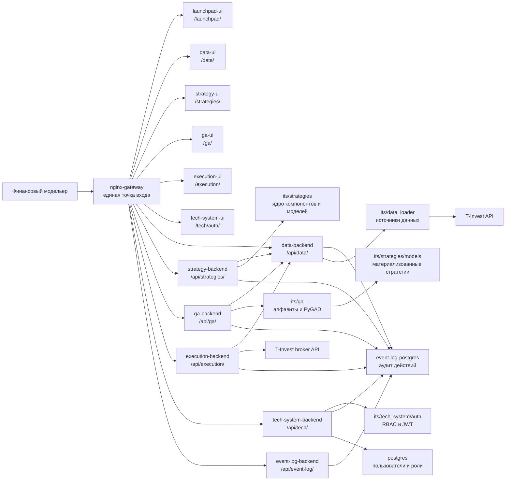

# Архитектура системы

[К оглавлению](README.md)

## Общий вид

ITS состоит из шести пользовательских интерфейсов, шести backend-сервисов, Python-ядра моделей, подсистемы загрузки данных, GA-движка, Execution-контура, Tech System, журнала событий и observability-профиля.


```mermaid
flowchart LR
    User["Финансовый модельер"] --> Gateway["nginx-gateway<br/>единая точка входа"]

    Gateway --> Launchpad["launchpad-ui<br/>/launchpad/"]
    Gateway --> DataUI["data-ui<br/>/data/"]
    Gateway --> StrategyUI["strategy-ui<br/>/strategies/"]
    Gateway --> GAUI["ga-ui<br/>/ga/"]
    Gateway --> ExecutionUI["execution-ui<br/>/execution/"]
    Gateway --> TechUI["tech-system-ui<br/>/tech/auth/"]

    Gateway --> DataAPI["data-backend<br/>/api/data/"]
    Gateway --> StrategyAPI["strategy-backend<br/>/api/strategies/"]
    Gateway --> GAAPI["ga-backend<br/>/api/ga/"]
    Gateway --> ExecutionAPI["execution-backend<br/>/api/execution/"]
    Gateway --> TechAPI["tech-system-backend<br/>/api/tech/"]
    Gateway --> EventLogAPI["event-log-backend<br/>/api/event-log/"]

    StrategyAPI --> DataAPI
    GAAPI --> DataAPI
    ExecutionAPI --> DataAPI
    ExecutionAPI --> Broker["T-Invest broker API"]
    StrategyAPI --> Core["its/strategies<br/>ядро компонентов и моделей"]
    GAAPI --> GA["its/ga<br/>алфавиты и PyGAD"]
    GA --> Models["its/strategies/models<br/>материализованные стратегии"]
    TechAPI --> Auth["its/tech_system/auth<br/>RBAC и JWT"]
    DataAPI --> EventDB
    StrategyAPI --> EventDB
    GAAPI --> EventDB
    ExecutionAPI --> EventDB
    TechAPI --> EventDB
    DataAPI --> Loader["its/data_loader<br/>источники данных"]
    Loader --> TInvest["T-Invest API"]
    TechAPI --> AppDB["postgres<br/>пользователи и роли"]
    EventLogAPI --> EventDB["event-log-postgres<br/>аудит действий"]
```

## Контейнеры Docker Compose

| Сервис | Путь | Назначение |
| --- | --- | --- |
| `nginx-gateway` | `infra/nginx` | маршрутизация UI, API и документации |
| `launchpad-ui` | `ui/launchpad-ui` | стартовый экран системы |
| `data-ui` | `ui/data-ui` | интерфейс данных |
| `strategy-ui` | `ui/strategy-ui` | интерфейс моделей и тестов |
| `ga-ui` | `its/ui/ga-ui` | интерфейс GA-генерации |
| `execution-ui` | `ui/execution-ui` | интерфейс брокерских счетов и заявок |
| `tech-system-ui` | `ui/tech-system-ui` | интерфейс входа, регистрации и ролей |
| `data-backend` | `services/data_backend` | API источников данных |
| `strategy-backend` | `services/strategy_backend` | API реестра моделей и тестов |
| `ga-backend` | `its/services/ga_backend` | API генетического алгоритма |
| `execution-backend` | `its/services/execution_backend` | API брокерских счетов, заявок и назначенных стратегий |
| `tech-system-backend` | `services/tech_system_backend` | API аутентификации, пользователей, ролей и permissions |
| `event-log-backend` | `services/event_log_backend` | API чтения журнала пользовательских и API-действий |
| `postgres` | Docker volume `postgres-data` | прикладная БД: пользователи, роли, назначения стратегий |
| `event-log-postgres` | Docker volume `event-log-postgres-data` | отдельная БД журнала событий |

## Маршрутизация gateway

`nginx-gateway` открывает наружу один порт и маршрутизирует запросы:

| Внешний путь | Внутренний сервис |
| --- | --- |
| `/` | redirect на `/launchpad/` |
| `/launchpad/` | `launchpad-ui` |
| `/data/` | `data-ui` |
| `/strategies/` | `strategy-ui` |
| `/ga/` | `ga-ui` |
| `/execution/` | `execution-ui` |
| `/tech/` | `tech-system-ui` |
| `/docs/` | Markdown-документация из папки `docs` |
| `/api/data/` | `data-backend` |
| `/api/strategies/` | `strategy-backend` |
| `/api/ga/` | `ga-backend` |
| `/api/execution/` | `execution-backend` |
| `/api/tech/` | `tech-system-backend` |
| `/api/event-log/` | `event-log-backend` |
| `/grafana/` | `grafana`, только профиль `observability` |
| `/opensearch-api/` | `opensearch`, только профиль `observability` |

## Backend-архитектура

### Data Backend

Путь:

```text
services/data_backend
```

Основные функции:

- health-check;
- список источников данных;
- справочник акций;
- справочник валют;
- загрузка свечей;
- построение custom gold bars;
- загрузка дивидендов;
- нормализация и кэширование ответов.

Data Backend использует код загрузчиков из:

```text
its/data_loader
```

### Strategy Backend

Путь:

```text
services/strategy_backend
```

Основные функции:

- реестр компонентов;
- реестр моделей ядра торговой стратегии;
- реестр полноценных торговых стратегий;
- детальная структура выбранной модели;
- запуск и чтение CPCV-тестов;
- запуск и чтение WalkForward-тестов;
- запуск и чтение Backtesting-тестов;
- сравнение стратегий по последним сохраненным тестам.

### GA Backend

Путь:

```text
its/services/ga_backend
```

Основные функции:

- чтение алфавитов генетического алгоритма;
- запуск GA-задачи в фоне;
- мониторинг статуса запуска;
- сохранение истории запусков;
- материализация TOP-N стратегий в Python-код.

### Execution Backend

Путь:

```text
its/services/execution_backend
```

Основные функции:

- health-check с режимом отправки заявок;
- чтение настроенных брокерских счетов T-Invest;
- обзор счета: портфель, позиции, заявки, stop-заявки, операции и маржинальные атрибуты;
- отправка обычных и stop-заявок в `real` или `stub` режиме;
- получение последней цены и WebSocket order book;
- назначение trading strategies на счет и запуск preview/исполнения назначенной стратегии.

### Tech System Backend

Путь:

```text
services/tech_system_backend
```

Основные функции:

- регистрация, вход, refresh и logout;
- JWT access/refresh tokens;
- RBAC: роли, permissions и назначение ролей пользователям;
- заявки на роли и их согласование;
- аудит auth- и role-событий.

### Event Log Backend

Путь:

```text
services/event_log_backend
```

Основные функции:

- чтение append-only журнала действий;
- фильтрация по сервису, пользователю, HTTP-методу, пути, IP и датам;
- выдача доступных значений фильтров;
- отдельное хранение в `event-log-postgres`.

### Observability

Профиль `observability` добавляет Prometheus, Alertmanager, Grafana, OpenSearch, OpenSearch Dashboards, Fluent Bit, OpenTelemetry Collector, exporters, cAdvisor и GlitchTip. Backend-сервисы устанавливают общий middleware `its/observability` и отдают метрики на `/metrics`.

## Frontend-архитектура

Все UI написаны на Vue 3, TypeScript и Vite.

| UI | Путь | Роль |
| --- | --- | --- |
| Launchpad | `ui/launchpad-ui` | плитки запуска подсистем |
| Data UI | `ui/data-ui` | работа с рыночными данными |
| Strategy UI | `ui/strategy-ui` | работа с моделями, тестами и сравнением |
| GA UI | `its/ui/ga-ui` | настройка и мониторинг генетического алгоритма |
| Execution UI | `ui/execution-ui` | счета, портфель, заявки, order book и назначенные стратегии |
| Tech System UI | `ui/tech-system-ui` | вход, регистрация, роли, permissions и журнал событий |

Интерфейсы обращаются к API через gateway, поэтому пользователю не нужно знать внутренние адреса контейнеров.

## Кодовое ядро стратегий

Ключевые директории:

| Путь | Назначение |
| --- | --- |
| `its/strategies/core/selectors` | предварительная фильтрация активов |
| `its/strategies/core/signals` | сигнальные модели |
| `its/strategies/core/optimization` | аллокаторы портфеля |
| `its/strategies/core/types` | базовые типы и протоколы |
| `its/strategies/models` | готовые модели ядра торговой стратегии |
| `its/strategies_model/core` | полноценная торговая стратегия и политики выхода |
| `its/strategies_model/model` | собранные trading strategies |
| `its/strategies/testing` | CPCV, WalkForward, Backtesting, comparison |
| `its/ga/alphabets` | алфавиты генов для GA |
| `its/ga` | registry, engine, materialization |
| `its/execution` | доменная логика Execution, схемы заявок, интеграция T-Invest |
| `its/tech_system/auth` | RBAC, JWT, схемы и маршруты технической подсистемы |
| `its/event_log` | middleware, repository, schemas и router журнала событий |
| `its/observability` | logging, metrics, tracing и error tracking |
| `its/db` | модели SQLAlchemy и Alembic-миграции |
| `its/authz` | единый контекст авторизации для backend-сервисов |

## Pipeline стратегии

Ядро торговой стратегии использует pipeline:

```text
pre-selection -> signal -> allocation
```

Каждый шаг можно заменить новым компонентом при соблюдении интерфейса. Такой подход позволяет:

- добавлять компоненты без изменения существующих моделей;
- комбинировать компоненты вручную;
- комбинировать компоненты автоматически через GA;
- использовать единый контур тестирования для всех стратегий.

## Входные и выходные данные

### Входные данные

- справочник инструментов;
- исторические свечи OHLCV;
- дивиденды;
- параметры тестирования;
- классы моделей;
- алфавиты GA;
- JWT-сессии и права пользователей;
- идентификаторы брокерских счетов и параметры заявок;
- события HTTP/API для журнала.

### Выходные данные

- очищенные таблицы данных;
- графики и таблицы в UI;
- JSON-отчеты CPCV, WalkForward и Backtesting;
- агрегированный рейтинг моделей;
- материализованные Python-классы сгенерированных стратегий;
- состояние счетов, портфеля, заявок и назначений стратегий;
- записи журнала событий;
- метрики, структурные логи и ошибки observability-контура;
- кэши данных и тестов.
