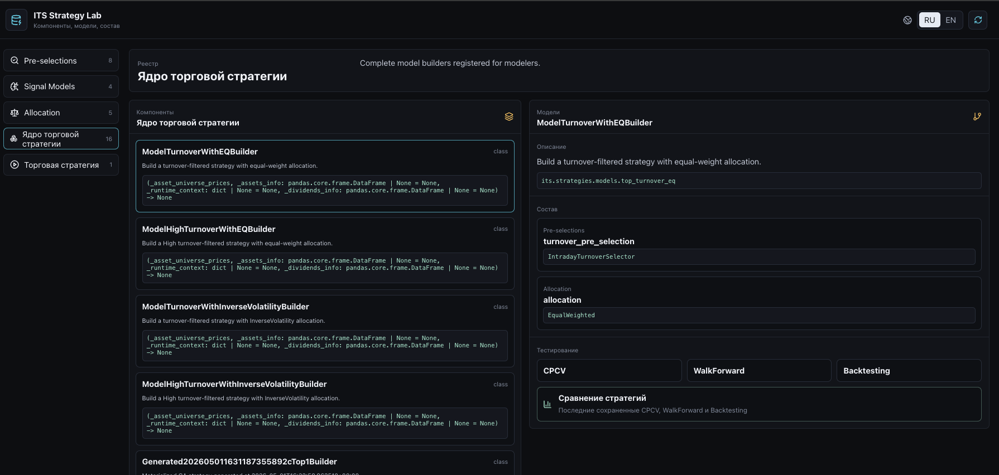
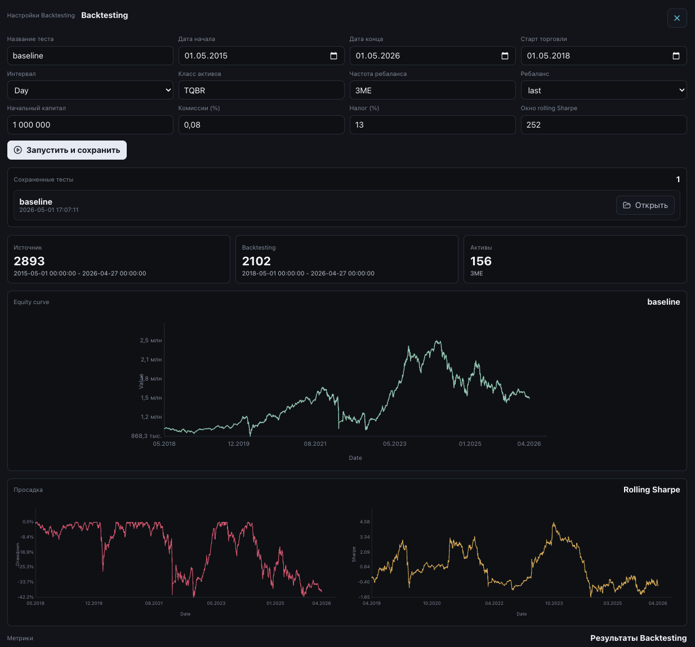
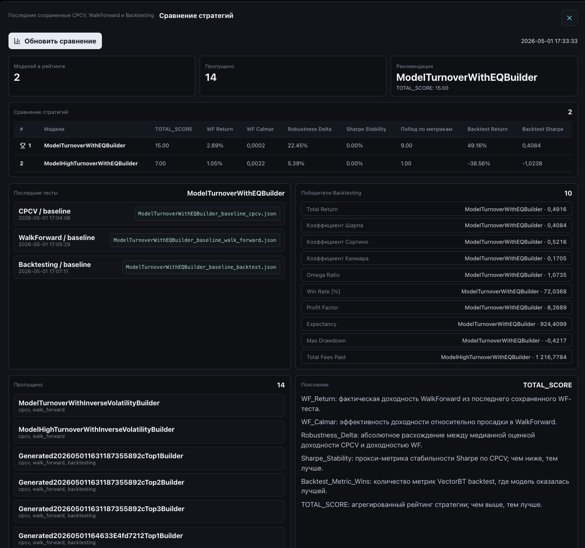

# Strategy Lab

[К оглавлению](README.md)

Strategy Lab - основная рабочая зона финансового модельера. Здесь отображаются компоненты, готовые модели, состав стратегии, тесты CPCV, WalkForward, Backtesting и сравнение моделей.



## Назначение

Strategy Lab нужен для:

- просмотра зарегистрированных компонентов;
- выбора готовой модели;
- понимания состава модели;
- запуска тестов;
- чтения сохраненных результатов;
- сравнения стратегий;
- анализа состава портфеля и секторной экспозиции.

## Основные файлы

| Путь | Назначение |
| --- | --- |
| `services/strategy_backend` | FastAPI backend Strategy Lab |
| `ui/strategy-ui` | Vue UI Strategy Lab |
| `its/strategies/core` | компоненты ядра |
| `its/strategies/models` | готовые модели ядра |
| `its/strategies/testing` | тестовые методики |
| `its/strategies_model` | полноценные торговые стратегии |

## Структура стратегии

Ядро стратегии состоит из трех последовательных шагов:

```text
pre-selection -> signal -> allocation
```

### Pre-selection

Первичная фильтрация активов. Селектор получает матрицу цен или доходностей и формирует маску активов, которые допускаются к дальнейшему анализу.

Примеры в текущей версии:

- `IntradayTurnoverSelector` - отбор по обороту;
- `CrossSectionalMomentumSelector` - отбор по cross-sectional momentum;
- `DividendHistorySelector` - отбор бумаг с дивидендной историей;
- `SectorSelector` - отбор по сектору;
- `TrendSelector` и `TrendThresholdSelector` - отбор по тренду;
- `KeepAllSelector` - пропуск без фильтрации;
- `SafeEmptySelector` - обертка, защищающая pipeline от пустой выборки.

### Signal

Сигнальный слой применяет дополнительную логику выбора или ранжирования после pre-selection.

Примеры:

- `KeepAllSignal` - пропускает все активы;
- `PriceBreakoutSignal` - выбирает активы с пробоем максимума;
- `SMACrossSignal` - сигнал пересечения скользящих средних;
- `TwoCandlePositiveTrendSignal` - сигнал положительной динамики последних свечей.

### Allocation

Аллокатор распределяет веса между выбранными активами.

Примеры:

- `EqualWeighted`;
- `InverseVolatility`;
- `HierarchicalRiskParity`;
- `CVaR`;
- `CVaRHighRisk`.

Аллокаторы используют skfolio и собственные расширения.

## Вкладки Strategy Lab

### Pre-selections

Показывает зарегистрированные селекторы. Для каждого элемента отображаются:

- имя класса;
- модуль;
- описание;
- сигнатура конструктора;
- параметры;
- путь к исходному коду.

### Signal Models

Показывает зарегистрированные сигнальные модели с теми же атрибутами.

### Allocation

Показывает зарегистрированные аллокаторы.

### Ядро торговой стратегии

Ключевая вкладка. Здесь отображаются модели из:

```text
its/strategies/models
```

Для выбранной модели пользователь видит:

- название;
- описание;
- состав pipeline;
- доступные тесты;
- список сохраненных отчетов;
- кнопки запуска CPCV, WalkForward, Backtesting.

### Торговая стратегия

Полная торговая стратегия включает:

- ядро портфельной модели;
- правила входа и выхода;
- stop-loss;
- take-profit;
- дополнительные политики жизненного цикла позиции.

Пример текущей стратегии:

```text
TurnoverEqStopLoss1TakeProfit3Builder
```

Она использует ядро `ModelTurnoverWithEQBuilder`, стоп-лосс `1%` и тейк-профит `3%`.

## CPCV

CPCV запускается в отдельном модальном окне.


Пользователь задает:

- название теста;
- дату начала;
- дату окончания;
- интервал;
- класс активов;
- `n_folds`;
- `n_test_folds`.

Результат:

- summary CPCV;
- метрики по test paths;
- графики кумулятивной доходности путей;
- список активов;
- сохраненный JSON-отчет.

## WalkForward

WalkForward запускается в отдельном модальном окне.


Пользователь задает:

- название теста;
- период данных;
- долю OOS-теста;
- размер train-окна в месяцах;
- частоту сдвига окна;
- размер WF test;
- класс активов и интервал.

Результат:

- список WalkForward-окон;
- метрики;
- графики отдельных окон;
- склеенная OOS equity curve;
- число удаленных дублей дат при склейке;
- сохраненный JSON-отчет.

## Backtesting

Backtesting запускается в отдельном модальном окне.



Пользователь задает:

- период данных;
- дату начала торговли;
- частоту ребаланса;
- правило даты ребаланса;
- начальный капитал;
- комиссии;
- проскальзывание;
- налоговую ставку;
- окно rolling Sharpe.

Результат:

- equity curve;
- drawdown curve;
- rolling Sharpe;
- таблица метрик vectorbt;
- summary доходности и риска;
- веса портфеля на ребалансировках;
- события stop-loss и take-profit для полноценных торговых стратегий.

### Состав портфеля

В результатах Backtesting можно открыть модальное окно состава портфеля.


Доступно:

- какие бумаги вошли в портфель на каждой ребалансировке;
- вес каждой бумаги;
- сумма весов;
- секторная агрегация;
- круговая диаграмма секторной экспозиции.

## Сравнение моделей

Сравнение стратегий открывается отдельным модальным окном.



Система берет последние сохраненные CPCV, WalkForward и Backtesting результаты по каждой модели и строит агрегированный рейтинг.

Используются показатели:

- `WF_Return`;
- `WF_Calmar`;
- `Robustness_Delta`;
- `Sharpe_Stability`;
- победы по Backtesting-метрикам;
- `TOTAL_SCORE`.

Модель попадает в сравнение только если для нее есть полный набор сохраненных тестов.

## Что сохраняется

Результаты тестов сохраняются в JSON-кэшах:

| Тип | Переменная окружения | Путь в контейнере |
| --- | --- | --- |
| CPCV | `STRATEGY_TEST_CACHE_DIR` | `/app/its/data/strategy_tests/cpcv` |
| WalkForward | `STRATEGY_WF_CACHE_DIR` | `/app/its/data/strategy_tests/walk_forward` |
| Backtesting | `STRATEGY_BACKTEST_CACHE_DIR` | `/app/its/data/strategy_tests/backtest` |

Docker Compose сохраняет эти данные в volume `strategy-test-cache`.

