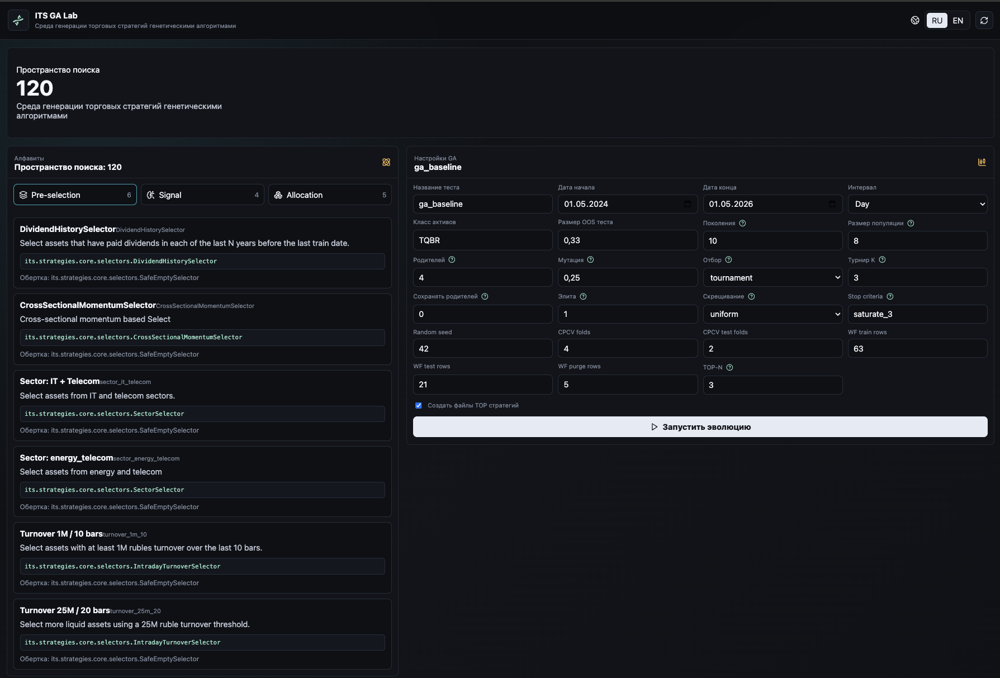

# GA Lab

[К оглавлению](README.md)

GA Lab - подсистема автоматической генерации торговых стратегий с использованием генетических алгоритмов.



## Назначение

GA Lab использует уже созданные компоненты системы как алфавит генов:

```text
pre-selection gene + signal gene + allocation gene = candidate strategy
```

Генетический алгоритм перебирает комбинации, оценивает их на исторических данных и сохраняет лучшие стратегии в кодовую базу.

## Основные файлы

| Путь | Назначение |
| --- | --- |
| `its/services/ga_backend` | FastAPI backend GA |
| `its/ui/ga-ui` | Vue UI GA Lab |
| `its/ga/engine.py` | основной GA-движок |
| `its/ga/registry.py` | загрузка алфавитов |
| `its/ga/types.py` | описание `GeneDefinition` |
| `its/ga/materialization.py` | генерация Python-файлов стратегий |
| `its/ga/alphabets` | алфавиты генов |
| `its/strategies/models` | папка, куда сохраняются TOP стратегии |

## Алфавиты

В системе три группы генов.

### Pre-selection

Папка:

```text
its/ga/alphabets/pre_selection
```

Текущие примеры:

- `DividendHistorySelector`;
- `CrossSectionalMomentumSelector`;
- `sector_it_telecom`;
- `sector_energy_telecom`;
- `turnover_1m_10`;
- `turnover_25m_20`.

### Signal

Папка:

```text
its/ga/alphabets/signal
```

Текущие примеры:

- `pass_signal`;
- `PriceBreakoutSignal`;
- `SMACrossSignal`;
- `TwoCandlePositiveTrendSignal`.

### Allocation

Папка:

```text
its/ga/alphabets/allocation
```

Текущие примеры:

- `equal_weighted`;
- `inverse_volatility`;
- `HierarchicalRiskParity`;
- `CVaR`;
- `CVaRHighRisk`.

## Пространство поиска

Размер пространства поиска равен произведению количества генов в группах:

```text
N(pre-selection) * N(signal) * N(allocation)
```

Каждый кандидат кодируется тремя индексами:

```text
(selector_idx, signal_idx, allocation_idx)
```

После декодирования кандидат получает имя:

```text
[GA][selector_name][signal_name][allocation_name]
```

## Настройки GA

В UI доступны параметры:

| Параметр | Назначение |
| --- | --- |
| `test_name` | имя запуска |
| `start_date`, `end_date` | период данных |
| `interval` | интервал свечей |
| `class_code` | класс активов, например `TQBR` |
| `test_size` | доля out-of-sample части |
| `num_generations` | количество поколений |
| `sol_per_pop` | размер популяции |
| `num_parents_mating` | число родителей |
| `mutation_probability` | вероятность мутации |
| `parent_selection_type` | метод отбора |
| `k_tournament` | размер турнира |
| `keep_parents` | сохранение родителей |
| `keep_elitism` | число элитных решений |
| `crossover_type` | тип скрещивания |
| `mutation_type` | тип мутации |
| `stop_criteria` | ранняя остановка PyGAD |
| `random_seed` | воспроизводимость |
| `cpcv_n_folds` | CPCV folds внутри оценки |
| `cpcv_n_test_folds` | CPCV test folds |
| `wf_train_size` | train rows для WalkForward |
| `wf_test_size` | test rows для WalkForward |
| `wf_purged_size` | purge rows |
| `top_n` | сколько лучших стратегий вернуть |
| `materialize_top` | создавать ли файлы TOP стратегий |

## Оценка кандидатов

Каждая стратегия-кандидат строится как pipeline:

```text
ga_pre_selection -> ga_signal -> ga_allocation
```

Далее GA-движок:

1. Загружает данные через Data Backend.
2. Строит матрицу доходностей.
3. Делит период на train и test.
4. Обучает pipeline на train.
5. Оценивает кандидата на test через CPCV и WalkForward.
6. Извлекает метрики.
7. Считает итоговый `TOTAL_SCORE`.

## Метрики fitness

В текущей версии используются:

| Метрика | Направление | Вес |
| --- | --- | --- |
| `WF_Return` | выше лучше | `0.30` |
| `WF_Calmar` | выше лучше | `0.30` |
| `Robustness_Delta` | ниже лучше | `0.20` |
| `Sharpe_Stability` | ниже лучше | `0.20` |

Также применяются штрафы:

- за максимальную просадку выше порога;
- за слишком узкий портфель, если активных активов мало.

Итоговая шкала:

```text
TOTAL_SCORE = 100 * weighted_score - penalties
```

## Результаты запуска

GA Lab отображает:

- статус запуска;
- поколения;
- лучший score;
- средний score;
- лучшего кандидата;
- популяцию;
- TOP стратегий;
- материализованные файлы;
- ошибки материализации, если они возникли.

## Материализация стратегий

Если включен `materialize_top`, TOP-N стратегий сохраняются в:

```text
its/strategies/models
```

Для каждого кандидата создается Python-файл вида:

```text
ga_generated_<run_id>_top_<rank>.py
```

Также обновляется:

```text
its/strategies/models/__init__.py
```

После этого стратегия становится видимой в Strategy Lab как обычная зарегистрированная модель.

## Кэши запусков

Запуски GA сохраняются в JSON:

```text
/app/its/data/ga_runs
```

В Docker Compose это volume:

```text
ga-cache
```

## Практический сценарий

1. Модельер создает новые компоненты: селекторы, сигналы, аллокаторы.
2. Добавляет их в GA-алфавиты.
3. Открывает GA Lab.
4. Настраивает период, размер популяции и число поколений.
5. Запускает эволюцию.
6. Смотрит TOP стратегий.
7. Материализует лучшие стратегии.
8. Открывает Strategy Lab.
9. Запускает полноценные тесты CPCV, WalkForward и Backtesting.
10. Сравнивает новые модели с существующими.

