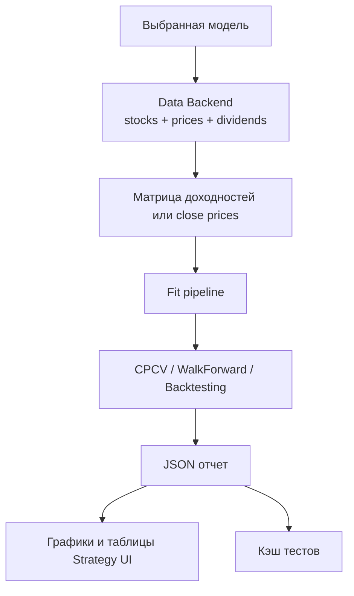

# Методики тестирования и сравнения моделей

[К оглавлению](README.md)

ITS содержит три основных типа проверки моделей:

1. CPCV.
2. WalkForward.
3. Backtesting.

Также реализовано агрегированное сравнение стратегий по последним сохраненным тестам.

## Общий поток данных для тестов



## Подготовка данных

Для CPCV и WalkForward используется матрица доходностей:

1. Берутся поля `time`, `ticker`, `close`.
2. Данные разворачиваются в wide matrix: строки - даты, колонки - тикеры.
3. Пропуски заполняются forward fill.
4. Удаляются активы с полностью пустыми или постоянными ценами.
5. Считается `pct_change`.
6. Первый пропуск заполняется нулем.

Для Backtesting используется матрица close prices, а для полноценных trading strategies также high/low prices для stop-loss и take-profit.

## CPCV

CPCV - Combinatorial Purged Cross-Validation. Методика нужна для оценки устойчивости стратегии и снижения риска переобучения.

В системе используется:

```text
skfolio.model_selection.CombinatorialPurgedCV
```

Параметры:

| Параметр | Смысл |
| --- | --- |
| `n_folds` | число фолдов |
| `n_test_folds` | число тестовых фолдов в комбинации |
| `start_date`, `end_date` | период данных |
| `interval` | интервал свечей |
| `class_code` | класс активов |

Что показывает CPCV:

- разброс результатов по путям;
- медианную доходность;
- среднюю доходность;
- стандартное отклонение доходности;
- стабильность Sharpe;
- количество тестовых путей;
- графики cumulative returns по путям.

Когда использовать:

- при первичной проверке новой модели;
- когда нужно понять, насколько стратегия чувствительна к разбиению данных;
- перед запуском более дорогого WalkForward или Backtesting.

## WalkForward

WalkForward проверяет стратегию на последовательных временных окнах.

В системе используется:

```text
skfolio.model_selection.WalkForward
```

Параметры:

| Параметр | Смысл |
| --- | --- |
| `test_size` | доля OOS-периода после первичного train split |
| `train_size_months` | размер train-окна |
| `freq_months` | частота сдвига окна |
| `wf_test_size` | размер test-участка |

Что показывает WalkForward:

- окна train/test;
- метрики по OOS-периодам;
- отдельные кривые окон;
- склеенную OOS equity curve;
- итоговую OOS доходность.

Когда использовать:

- для проверки поведения стратегии во времени;
- для оценки стабильности на последовательных рыночных режимах;
- для отбора стратегий перед Backtesting.

## Backtesting

Backtesting моделирует историческую торговлю с ребалансировками, комиссиями, проскальзыванием и начальным капиталом.

В системе используется:

```text
vectorbt
```

Параметры:

| Параметр | Смысл |
| --- | --- |
| `trading_start_date` | дата начала торговли |
| `rebalance_freq` | частота ребаланса, например `3ME` |
| `rebalance_on` | правило выбора даты ребаланса |
| `init_cash` | начальный капитал |
| `fees` | комиссии |
| `slippage` | проскальзывание |
| `tax_rate` | налоговая ставка для расчетного after-tax результата |
| `rolling_window` | окно rolling Sharpe |

Backtesting возвращает:

- итоговую доходность;
- доходность после налога;
- максимальную просадку;
- длительность максимальной просадки;
- equity curve;
- drawdown curve;
- rolling Sharpe;
- таблицу vectorbt stats;
- веса портфеля на каждой ребалансировке;
- состав портфеля;
- секторную агрегацию;
- события исполнения stop-loss и take-profit.

## Тестирование full trading strategy

Для моделей из `its/strategies_model/model` Backtesting дополнительно учитывает:

- high/low цены;
- правила выхода из позиции;
- `FixedStopTakeProfitPolicy`;
- события `stop_loss` и `take_profit`;
- цену входа;
- цену исполнения;
- доходность закрытой позиции.

## Сравнение стратегий

Сравнение выполняется endpoint:

```text
GET /api/strategies/comparison/latest
```

Система берет последние сохраненные:

- CPCV;
- WalkForward;
- Backtesting.

Модель пропускается, если у нее нет полного набора тестов.

## Метрики сравнения

| Метрика | Источник | Интерпретация |
| --- | --- | --- |
| `WF_Return` | WalkForward | реализованная OOS доходность |
| `WF_Calmar` | WalkForward | доходность относительно просадки |
| `Robustness_Delta` | CPCV + WF | расхождение между CPCV median return и WF return |
| `Sharpe_Stability` | CPCV | прокси стабильности Sharpe |
| `Backtest_Metric_Wins` | Backtesting | число побед по backtest-метрикам |
| `TOTAL_SCORE` | comparison | итоговый рейтинг |

## Метрики Backtesting, где выбираются победители

Для части метрик большее значение лучше:

- `Total Return`;
- `Sharpe Ratio`;
- `Sortino Ratio`;
- `Calmar Ratio`;
- `Omega Ratio`;
- `Win Rate [%]`;
- `Profit Factor`;
- `Expectancy`.

Для части метрик меньшее значение лучше:

- `Max Drawdown`;
- `Total Fees Paid`.

## Практическая интерпретация

Стратегия считается более перспективной, если:

- WalkForward показывает положительную OOS-доходность;
- Calmar Ratio выше альтернатив;
- разница между CPCV и WalkForward небольшая;
- разброс результатов по CPCV умеренный;
- Backtesting не показывает чрезмерную просадку;
- портфель не состоит из слишком малого числа активов;
- результаты не зависят от одного удачного периода.

## Ограничения

Результаты тестов не являются гарантией будущей доходности. Историческое тестирование отражает только поведение на доступных данных и зависит от качества данных, выбранных параметров, комиссий, ликвидности и рыночных режимов.

