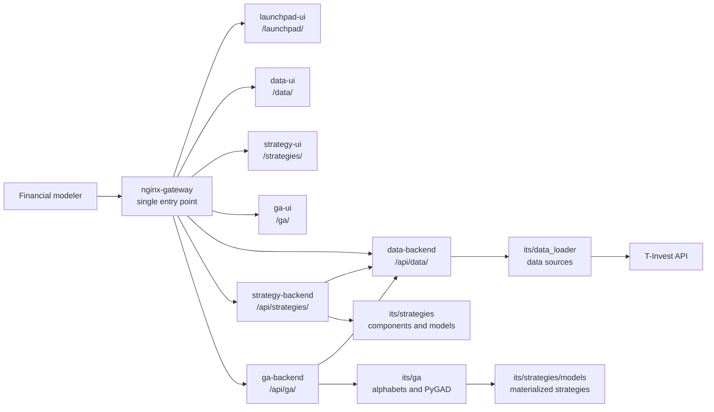

# System Architecture

[Back to Contents](README.md)

## Overview

ITS consists of four user interfaces, three backend services, a Python strategy core, a data-loading subsystem, and a GA engine.



## Docker Compose Containers

| Service | Path | Purpose |
| --- | --- | --- |
| `nginx-gateway` | `infra/nginx` | routes UI, API, and documentation |
| `launchpad-ui` | `ui/launchpad-ui` | system start screen |
| `data-ui` | `ui/data-ui` | data interface |
| `strategy-ui` | `ui/strategy-ui` | model and testing interface |
| `ga-ui` | `its/ui/ga-ui` | GA generation interface |
| `data-backend` | `services/data_backend` | data-source API |
| `strategy-backend` | `services/strategy_backend` | model registry and testing API |
| `ga-backend` | `its/services/ga_backend` | genetic-algorithm API |

## Gateway Routing

`nginx-gateway` exposes one external port and routes requests:

| External path | Internal service |
| --- | --- |
| `/` | redirect to `/launchpad/` |
| `/launchpad/` | `launchpad-ui` |
| `/data/` | `data-ui` |
| `/strategies/` | `strategy-ui` |
| `/ga/` | `ga-ui` |
| `/docs/` | rendered Markdown documentation |
| `/api/data/` | `data-backend` |
| `/api/strategies/` | `strategy-backend` |
| `/api/ga/` | `ga-backend` |

## Backend Architecture

### Data Backend

Path:

```text
services/data_backend
```

Main responsibilities:

- health check;
- data-source list;
- stock reference data;
- currency reference data;
- candle loading;
- custom gold bar construction;
- dividend loading;
- response normalization and caching.

It uses data-loading code from:

```text
its/data_loader
```

### Strategy Backend

Path:

```text
services/strategy_backend
```

Main responsibilities:

- component registry;
- core strategy model registry;
- full trading strategy registry;
- selected model details;
- CPCV execution and retrieval;
- WalkForward execution and retrieval;
- Backtesting execution and retrieval;
- latest-test model comparison.

### GA Backend

Path:

```text
its/services/ga_backend
```

Main responsibilities:

- read GA alphabets;
- start a GA job in the background;
- monitor run status;
- persist run history;
- materialize TOP-N strategies as Python code.

## Frontend Architecture

All UIs are written in Vue 3, TypeScript, and Vite.

| UI | Path | Role |
| --- | --- | --- |
| Launchpad | `ui/launchpad-ui` | subsystem launch tiles |
| Data UI | `ui/data-ui` | market data workspace |
| Strategy UI | `ui/strategy-ui` | components, strategies, tests, comparison |
| GA UI | `its/ui/ga-ui` | genetic algorithm configuration and monitoring |

The interfaces call APIs through the gateway, so the user does not need to know internal container addresses.

## Strategy Code Core

Key directories:

| Path | Purpose |
| --- | --- |
| `its/strategies/core/selectors` | pre-selection components |
| `its/strategies/core/signals` | signal models |
| `its/strategies/core/optimization` | portfolio allocators |
| `its/strategies/core/types` | base types and protocols |
| `its/strategies/models` | ready core strategy models |
| `its/strategies_model/core` | full trading strategy and exit policies |
| `its/strategies_model/model` | assembled trading strategies |
| `its/strategies/testing` | CPCV, WalkForward, Backtesting, comparison |
| `its/ga/alphabets` | GA gene alphabets |
| `its/ga` | registry, engine, materialization |

## Strategy Pipeline

The strategy core uses this pipeline:

```text
pre-selection -> signal -> allocation
```

Each step can be replaced by a new component that follows the interface. This enables manual composition, automatic GA composition, and a unified testing circuit.

## Inputs and Outputs

### Inputs

- instrument reference data;
- historical OHLCV candles;
- dividends;
- testing parameters;
- model classes;
- GA alphabets.

### Outputs

- cleaned data tables;
- UI charts and tables;
- JSON reports for CPCV, WalkForward, and Backtesting;
- aggregate model ranking;
- materialized Python classes for generated strategies;
- data and test caches.

