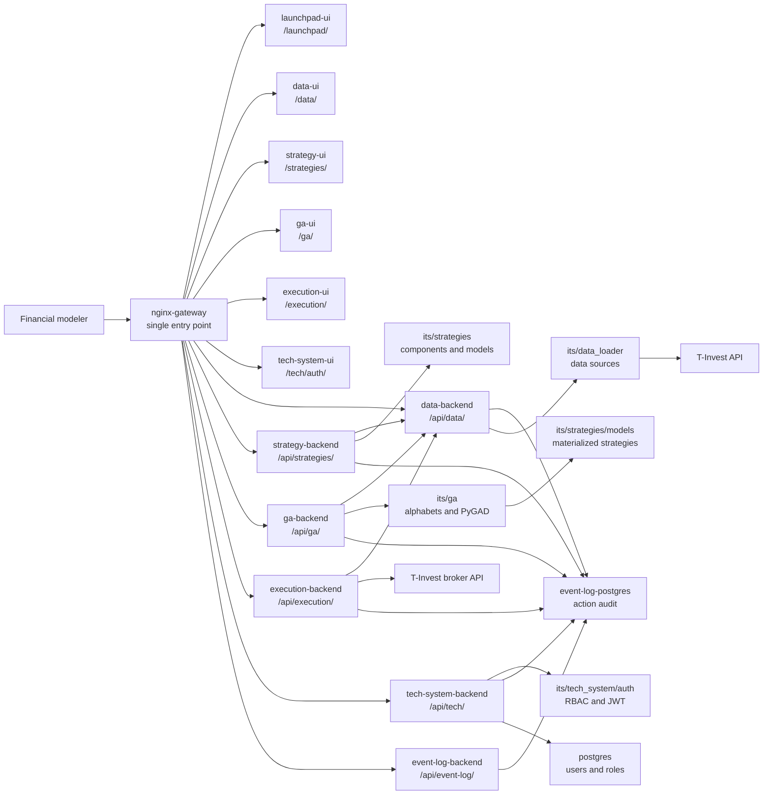

# System Architecture

[Back to Contents](README.md)

## Overview

ITS consists of six user interfaces, six backend services, a Python strategy core, a data-loading subsystem, a GA engine, an Execution circuit, Tech System, event logging, and an observability profile.


```mermaid
flowchart LR
    User["Financial modeler"] --> Gateway["nginx-gateway<br/>single entry point"]

    Gateway --> Launchpad["launchpad-ui<br/>/launchpad/"]
    Gateway --> DataUI["data-ui<br/>/data/"]
    Gateway --> StrategyUI["strategy-ui<br/>/strategies/"]
    Gateway --> GAUI["ga-ui<br/>/ga/"]
    Gateway --> ExecutionUI["execution-ui<br/>/execution/"]
    Gateway --> TechUI["tech-system-ui<br/>/tech/auth/"]

    Gateway --> DataAPI["data-backend<br/>/api/data/"]
    Gateway --> StrategyAPI["strategy-backend<br/>/api/strategies/"]
    Gateway --> GAAPI["ga-backend<br/>/api/ga/"]
    Gateway --> ExecutionAPI["execution-backend<br/>/api/execution/"]
    Gateway --> TechAPI["tech-system-backend<br/>/api/tech/"]
    Gateway --> EventLogAPI["event-log-backend<br/>/api/event-log/"]

    StrategyAPI --> DataAPI
    GAAPI --> DataAPI
    ExecutionAPI --> DataAPI
    ExecutionAPI --> Broker["T-Invest broker API"]
    StrategyAPI --> Core["its/strategies<br/>components and models"]
    GAAPI --> GA["its/ga<br/>alphabets and PyGAD"]
    GA --> Models["its/strategies/models<br/>materialized strategies"]
    TechAPI --> Auth["its/tech_system/auth<br/>RBAC and JWT"]
    DataAPI --> EventDB
    StrategyAPI --> EventDB
    GAAPI --> EventDB
    ExecutionAPI --> EventDB
    TechAPI --> EventDB
    DataAPI --> Loader["its/data_loader<br/>data sources"]
    Loader --> TInvest["T-Invest API"]
    TechAPI --> AppDB["postgres<br/>users and roles"]
    EventLogAPI --> EventDB["event-log-postgres<br/>action audit"]
```

## Docker Compose Containers

| Service | Path | Purpose |
| --- | --- | --- |
| `nginx-gateway` | `infra/nginx` | routes UI, API, and documentation |
| `launchpad-ui` | `ui/launchpad-ui` | system start screen |
| `data-ui` | `ui/data-ui` | data interface |
| `strategy-ui` | `ui/strategy-ui` | model and testing interface |
| `ga-ui` | `its/ui/ga-ui` | GA generation interface |
| `execution-ui` | `ui/execution-ui` | broker account and order interface |
| `tech-system-ui` | `ui/tech-system-ui` | login, registration, and role interface |
| `data-backend` | `services/data_backend` | data-source API |
| `strategy-backend` | `services/strategy_backend` | model registry and testing API |
| `ga-backend` | `its/services/ga_backend` | genetic-algorithm API |
| `execution-backend` | `its/services/execution_backend` | broker accounts, orders, and assigned-strategy API |
| `tech-system-backend` | `services/tech_system_backend` | authentication, users, roles, and permissions API |
| `event-log-backend` | `services/event_log_backend` | user and API action log read API |
| `postgres` | Docker volume `postgres-data` | application DB: users, roles, strategy assignments |
| `event-log-postgres` | Docker volume `event-log-postgres-data` | separate event-log DB |

## Gateway Routing

`nginx-gateway` exposes one external port and routes requests:

| External path | Internal service |
| --- | --- |
| `/` | redirect to `/launchpad/` |
| `/launchpad/` | `launchpad-ui` |
| `/data/` | `data-ui` |
| `/strategies/` | `strategy-ui` |
| `/ga/` | `ga-ui` |
| `/execution/` | `execution-ui` |
| `/tech/` | `tech-system-ui` |
| `/docs/` | rendered Markdown documentation |
| `/api/data/` | `data-backend` |
| `/api/strategies/` | `strategy-backend` |
| `/api/ga/` | `ga-backend` |
| `/api/execution/` | `execution-backend` |
| `/api/tech/` | `tech-system-backend` |
| `/api/event-log/` | `event-log-backend` |
| `/grafana/` | `grafana`, `observability` profile only |
| `/opensearch-api/` | `opensearch`, `observability` profile only |

## Backend Architecture

### Data Backend

Path:

```text
services/data_backend
```

Main responsibilities:

- health check;
- data-source list;
- stock reference data;
- currency reference data;
- candle loading;
- custom gold bar construction;
- dividend loading;
- response normalization and caching.

It uses data-loading code from:

```text
its/data_loader
```

### Strategy Backend

Path:

```text
services/strategy_backend
```

Main responsibilities:

- component registry;
- core strategy model registry;
- full trading strategy registry;
- selected model details;
- CPCV execution and retrieval;
- WalkForward execution and retrieval;
- Backtesting execution and retrieval;
- latest-test model comparison.

### GA Backend

Path:

```text
its/services/ga_backend
```

Main responsibilities:

- read GA alphabets;
- start a GA job in the background;
- monitor run status;
- persist run history;
- materialize TOP-N strategies as Python code.

### Execution Backend

Path:

```text
its/services/execution_backend
```

Main responsibilities:

- health check with order-submission mode;
- read configured T-Invest broker accounts;
- account overview: portfolio, positions, orders, stop orders, operations, and margin attributes;
- submit regular and stop orders in `real` or `stub` mode;
- provide last price and WebSocket order book;
- assign trading strategies to accounts and run assigned-strategy preview/execution.

### Tech System Backend

Path:

```text
services/tech_system_backend
```

Main responsibilities:

- registration, login, refresh, and logout;
- JWT access and refresh tokens;
- RBAC: roles, permissions, and user role assignment;
- role requests and approval workflow;
- audit records for auth and role events.

### Event Log Backend

Path:

```text
services/event_log_backend
```

Main responsibilities:

- read the append-only action log;
- filter by service, user, HTTP method, path, IP, and dates;
- return available filter values;
- store events separately in `event-log-postgres`.

### Observability

The `observability` profile adds Prometheus, Alertmanager, Grafana, OpenSearch, OpenSearch Dashboards, Fluent Bit, OpenTelemetry Collector, exporters, cAdvisor, and GlitchTip. Backend services install shared `its/observability` middleware and expose metrics on `/metrics`.

## Frontend Architecture

All UIs are written in Vue 3, TypeScript, and Vite.

| UI | Path | Role |
| --- | --- | --- |
| Launchpad | `ui/launchpad-ui` | subsystem launch tiles |
| Data UI | `ui/data-ui` | market data workspace |
| Strategy UI | `ui/strategy-ui` | components, strategies, tests, comparison |
| GA UI | `its/ui/ga-ui` | genetic algorithm configuration and monitoring |
| Execution UI | `ui/execution-ui` | accounts, portfolio, orders, order book, assigned strategies |
| Tech System UI | `ui/tech-system-ui` | login, registration, roles, permissions, event log |

The interfaces call APIs through the gateway, so the user does not need to know internal container addresses.

## Strategy Code Core

Key directories:

| Path | Purpose |
| --- | --- |
| `its/strategies/core/selectors` | pre-selection components |
| `its/strategies/core/signals` | signal models |
| `its/strategies/core/optimization` | portfolio allocators |
| `its/strategies/core/types` | base types and protocols |
| `its/strategies/models` | ready core strategy models |
| `its/strategies_model/core` | full trading strategy and exit policies |
| `its/strategies_model/model` | assembled trading strategies |
| `its/strategies/testing` | CPCV, WalkForward, Backtesting, comparison |
| `its/ga/alphabets` | GA gene alphabets |
| `its/ga` | registry, engine, materialization |
| `its/execution` | Execution domain logic, order schemas, T-Invest integration |
| `its/tech_system/auth` | RBAC, JWT, schemas, and technical-subsystem routes |
| `its/event_log` | event-log middleware, repository, schemas, and router |
| `its/observability` | logging, metrics, tracing, and error tracking |
| `its/db` | SQLAlchemy models and Alembic migrations |
| `its/authz` | shared authorization context for backend services |

## Strategy Pipeline

The strategy core uses this pipeline:

```text
pre-selection -> signal -> allocation
```

Each step can be replaced by a new component that follows the interface. This enables manual composition, automatic GA composition, and a unified testing circuit.

## Inputs and Outputs

### Inputs

- instrument reference data;
- historical OHLCV candles;
- dividends;
- testing parameters;
- model classes;
- GA alphabets;
- JWT sessions and user permissions;
- broker account IDs and order parameters;
- HTTP/API events for the event log.

### Outputs

- cleaned data tables;
- UI charts and tables;
- JSON reports for CPCV, WalkForward, and Backtesting;
- aggregate model ranking;
- materialized Python classes for generated strategies;
- account, portfolio, order, and strategy-assignment state;
- event-log records;
- metrics, structured logs, and observability errors;
- data and test caches.
