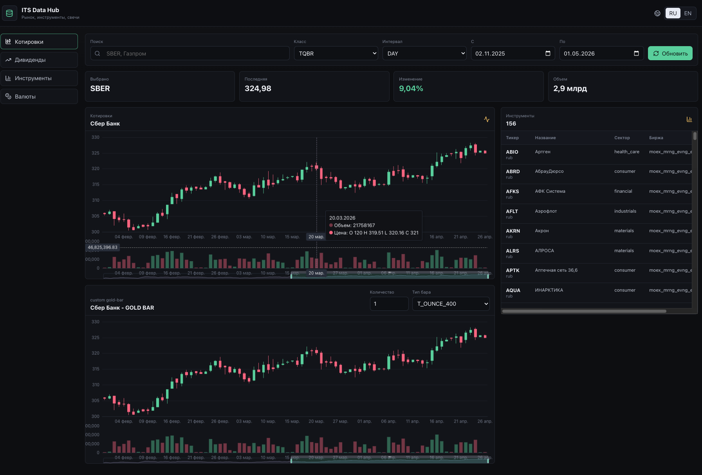

# Data Hub

[Back to Contents](README.md)

Data Hub is the ITS data subsystem. It connects sources, retrieves market information, normalizes data, and provides a unified API for other services.



## Purpose

Data Hub solves three groups of tasks:

- gives the modeler a visual interface for data exploration;
- provides backend API for Strategy Lab and GA Lab;
- isolates external source integrations from strategy logic.

## Main Files

| Path | Purpose |
| --- | --- |
| `services/data_backend/app/main.py` | Data Backend FastAPI application |
| `ui/data-ui` | Data Hub Vue interface |
| `its/data_loader` | data loaders and source adapters |
| `its/data_loader/t_invest_data_readers` | connected T-Invest source |
| `its/data_loader/custom_bar/gold_bar` | custom gold bar construction |

## Data Available in the Base Version

The base version connects T-Invest and provides:

- Russian equities;
- currency instruments;
- OHLCV candles;
- ticker reference data;
- sectors, exchanges, currencies, instrument classes;
- dividends;
- custom gold bars recalculated through gold.

## UI Sections

### Quotes

Used to inspect candles for a selected instrument.

The user selects:

- instrument class, for example `TQBR`;
- candle interval;
- start date;
- end date;
- instrument.

The UI displays:

- candlestick chart;
- latest price;
- percentage change for the period;
- number of candles;
- volume.

### Dividends

Shows dividend history for the selected security:

- declaration date;
- last buy date;
- record date;
- payment date;
- dividend amount;
- yield;
- type and regularity.

Dividends are also used as input data for components such as `DividendHistorySelector`.

### Instruments

Stock reference section. The user can search by name or ticker and see:

- FIGI;
- ticker;
- ISIN;
- name;
- sector;
- exchange;
- currency;
- country of risk;
- lot;
- trading status;
- buy/sell availability.

### Currencies

Currency instrument section. It is also used for `GLDRUB_TOM`, which is required for custom gold bars.

### Custom Gold Bar

Data Hub can build alternative bars through gold value. The user sets:

- base instrument;
- gold instrument, default `GLDRUB_TOM`;
- number of gold units;
- bar type, for example `GRAM`, `T_OUNCE`, `KG`, `T_OUNCE_400`;
- period and interval.

The result is OHLCV bars recalculated through the value of the selected gold amount.

## Data Backend API

External requests go through the gateway:

```text
/api/data/
```

Main endpoints:

| Endpoint | Purpose |
| --- | --- |
| `GET /api/data/health` | status check |
| `GET /api/data/sources` | source list |
| `GET /api/data/stocks` | stock list |
| `GET /api/data/currencies` | currency list |
| `GET /api/data/prices` | OHLCV candles |
| `GET /api/data/custom-gold-bars` | custom gold bars |
| `GET /api/data/dividends` | dividends |
| `GET /api/data/docs` | Swagger |

## Supported Candle Intervals

- `CANDLE_INTERVAL_1_MIN`;
- `CANDLE_INTERVAL_5_MIN`;
- `CANDLE_INTERVAL_15_MIN`;
- `CANDLE_INTERVAL_HOUR`;
- `CANDLE_INTERVAL_DAY`;
- `CANDLE_INTERVAL_WEEK`;
- `CANDLE_INTERVAL_MONTH`.

## Caching

T-Invest loaders use a file cache inside `its/data` in the container. Docker Compose maps it to the volume:

```text
t-invest-cache
```

The cache reduces external API calls, speeds up repeated tests, and reuses already-loaded periods.

## Adding a New Data Source

New integrations are added under:

```text
its/data_loader
```

Recommended workflow:

1. Create a source adapter.
2. Normalize output fields to the format expected by Data Backend.
3. Add a use case if dedicated business logic is required.
4. Extend Data Backend endpoints or add a new one.
5. Update Data UI if the data must be visually available.

## Data Requirements for Strategies

Strategies and tests expect candles to contain at least:

| Field | Purpose |
| --- | --- |
| `time` | candle date and time |
| `ticker` | instrument ticker |
| `figi` | FIGI |
| `open` | open price |
| `high` | high price |
| `low` | low price |
| `close` | close price |
| `volume` | volume |
| `is_complete` | completed-candle flag |

Dividend selectors require:

| Field | Purpose |
| --- | --- |
| `ticker` | ticker |
| `last_buy_date` | last buy date to receive the dividend |

