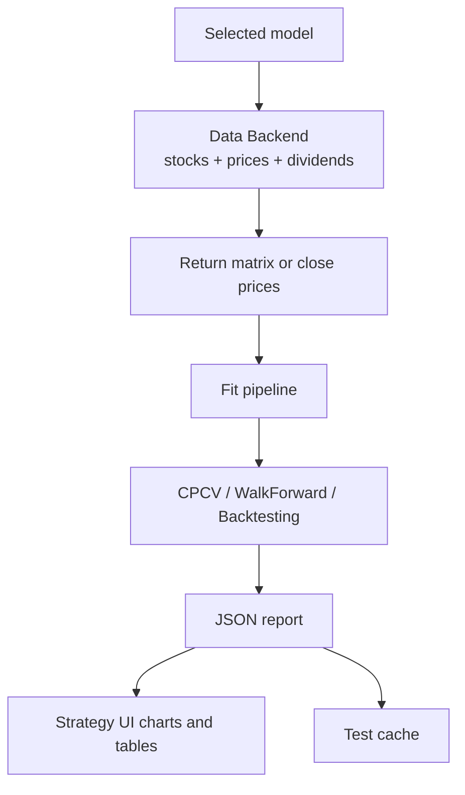

# Testing and Model Comparison Methodology

[Back to Contents](README.md)

ITS contains three main model-validation methods:

1. CPCV.
2. WalkForward.
3. Backtesting.

It also implements aggregate model comparison by the latest saved tests.

## General Data Flow



## Data Preparation

CPCV and WalkForward use a return matrix:

1. Use `time`, `ticker`, and `close`.
2. Pivot data into a wide matrix: rows are dates, columns are tickers.
3. Forward-fill missing prices.
4. Remove assets with fully empty or constant prices.
5. Compute `pct_change`.
6. Fill the initial missing return with zero.

Backtesting uses close prices. Full trading strategies also use high/low prices for stop-loss and take-profit processing.

## CPCV

CPCV means Combinatorial Purged Cross-Validation. It is used to assess strategy robustness and reduce overfitting risk.

The system uses:

```text
skfolio.model_selection.CombinatorialPurgedCV
```

Parameters:

| Parameter | Meaning |
| --- | --- |
| `n_folds` | number of folds |
| `n_test_folds` | number of test folds per combination |
| `start_date`, `end_date` | data period |
| `interval` | candle interval |
| `class_code` | asset class |

CPCV shows:

- result dispersion across paths;
- median return;
- average return;
- return standard deviation;
- Sharpe stability;
- number of test paths;
- cumulative-return charts by path.

Use it:

- for initial validation of a new model;
- when estimating sensitivity to data splitting;
- before more expensive WalkForward or Backtesting runs.

## WalkForward

WalkForward tests a strategy on sequential time windows.

The system uses:

```text
skfolio.model_selection.WalkForward
```

Parameters:

| Parameter | Meaning |
| --- | --- |
| `test_size` | fraction of OOS period after initial train split |
| `train_size_months` | train-window size |
| `freq_months` | window shift frequency |
| `wf_test_size` | test-segment size |

WalkForward shows:

- train/test windows;
- OOS-period metrics;
- separate window curves;
- stitched OOS equity curve;
- final OOS return.

Use it:

- to validate behavior over time;
- to evaluate stability across market regimes;
- to select strategies before Backtesting.

## Backtesting

Backtesting simulates historical trading with rebalances, fees, slippage, and initial capital.

The system uses:

```text
vectorbt
```

Parameters:

| Parameter | Meaning |
| --- | --- |
| `trading_start_date` | trading start date |
| `rebalance_freq` | rebalance frequency, for example `3ME` |
| `rebalance_on` | rebalance date rule |
| `init_cash` | initial capital |
| `fees` | fees |
| `slippage` | slippage |
| `tax_rate` | tax rate for after-tax estimate |
| `rolling_window` | rolling Sharpe window |

Backtesting returns:

- total return;
- after-tax return;
- maximum drawdown;
- maximum drawdown duration;
- equity curve;
- drawdown curve;
- rolling Sharpe;
- vectorbt stats table;
- portfolio weights at each rebalance;
- portfolio composition;
- sector structure;
- stop-loss and take-profit events.

## Full Trading Strategy Testing

For models from `its/strategies_model/model`, Backtesting additionally considers:

- high/low prices;
- exit policies;
- `FixedStopTakeProfitPolicy`;
- `stop_loss` and `take_profit` events;
- entry price;
- execution price;
- closed-position return.

## Strategy Comparison

Comparison endpoint:

```text
GET /api/strategies/comparison/latest
```

The system uses latest saved:

- CPCV;
- WalkForward;
- Backtesting.

A model is skipped if it does not have the full test set.

## Comparison Metrics

| Metric | Source | Interpretation |
| --- | --- | --- |
| `WF_Return` | WalkForward | realized OOS return |
| `WF_Calmar` | WalkForward | return relative to drawdown |
| `Robustness_Delta` | CPCV + WF | gap between CPCV median return and WF return |
| `Sharpe_Stability` | CPCV | Sharpe stability proxy |
| `Backtest_Metric_Wins` | Backtesting | number of backtest metric wins |
| `TOTAL_SCORE` | comparison | final ranking |

## Backtesting Metrics Used for Winners

Higher is better:

- `Total Return`;
- `Sharpe Ratio`;
- `Sortino Ratio`;
- `Calmar Ratio`;
- `Omega Ratio`;
- `Win Rate [%]`;
- `Profit Factor`;
- `Expectancy`.

Lower is better:

- `Max Drawdown`;
- `Total Fees Paid`.

## Practical Interpretation

A strategy is more promising when:

- WalkForward shows positive OOS return;
- Calmar Ratio is higher than alternatives;
- the gap between CPCV and WalkForward is small;
- CPCV dispersion is moderate;
- Backtesting does not show excessive drawdown;
- the portfolio is not concentrated in too few assets;
- results do not depend on one lucky period.

## Limitations

Test results are not a guarantee of future performance. Historical validation reflects only the available data and depends on data quality, selected parameters, fees, liquidity, and market regimes.

