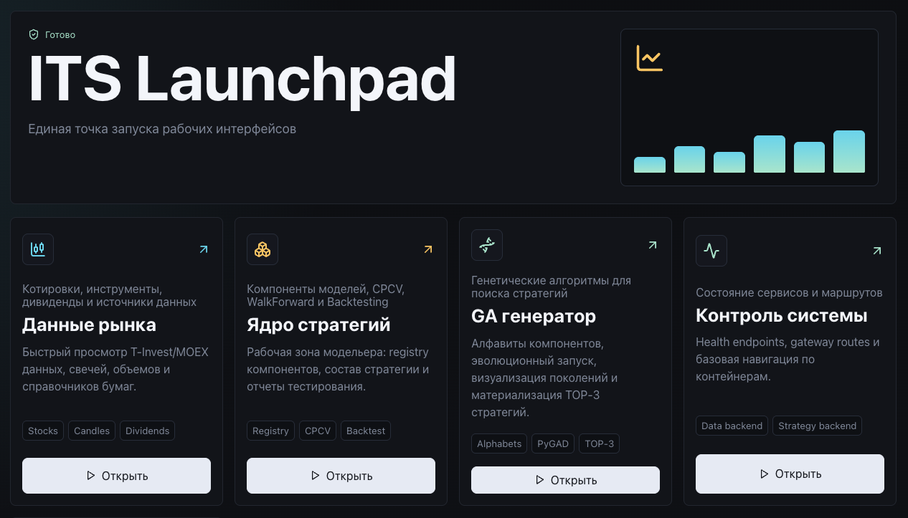

# ITS Documentation

**ITS (Intelligent Trading Strategies)** is an intelligent system for designing, testing, comparing, and evolving trading strategies for exchange-traded markets, including equities, currencies, and crypto assets when the corresponding data adapters are added.

The primary user is a financial modeler, quant researcher, or analyst who designs trading models, validates their robustness on historical data, and assembles strategies from standardized components.



## Documentation Map

1. [Purpose and User Roles](01-product-overview.md)
2. [Installation, Prerequisites, and Launch](02-installation-and-launch.md)
3. [System Architecture](03-system-architecture.md)
4. [Data Hub: Data, Instruments, Dividends, and Custom Bars](04-data-hub.md)
5. [Strategy Lab: Components, Models, and Testing](05-strategy-lab.md)
6. [GA Lab: Genetic Strategy Generation](06-ga-lab.md)
7. [Modeler and Component Developer Guide](07-model-development-guide.md)
8. [Testing and Model Comparison Methodology](08-testing-methodology.md)
9. [API and Integrations](09-api-reference.md)
10. [Operations, Configuration, and Delivery](10-operations-and-delivery.md)
11. [Scientific Basis and Author Publications](11-scientific-basis.md)
12. [Glossary](12-glossary.md)

## Quick Start

1. Install Docker and Docker Compose v2.
2. Create a `.env` file in the repository root and set the T-Invest token:

```dotenv
tinvest_token=your_tinkoff_invest_token
```

3. Start the whole system with one command:

```bash
docker compose up --build
```

4. Open the main entry point:

[http://localhost:8080/launchpad/](http://localhost:8080/launchpad/)

## Main Interfaces

| Interface | URL | Purpose |
| --- | --- | --- |
| Launchpad | `/launchpad/` | Main screen for opening subsystems |
| Data Hub | `/data/` | Market data, instruments, quotes, dividends |
| Strategy Lab | `/strategies/` | Component registry, model assembly, testing |
| GA Lab | `/ga/` | Strategy generation with genetic algorithms |
| Data API | `/api/data/docs` | Data Backend Swagger |
| Strategy API | `/api/strategies/docs` | Strategy Backend Swagger |
| GA API | `/api/ga/docs` | GA Backend Swagger |

## What the User Gets

The system gives the modeler a single workspace for:

- connecting market data sources;
- exploring instruments, quotes, dividends, and derived bars;
- creating model components: `pre-selection`, `signal`, and `allocation`;
- assembling standardized strategies from those components;
- testing strategies with CPCV, WalkForward, and Backtesting;
- comparing strategies by an aggregate score;
- defining genetic-algorithm alphabets and generating new strategies automatically;
- materializing the best GA candidates as Python code in the model registry.

## Current Implementation Status

The current version is a research and laboratory platform for forming, analyzing, testing, and generating trading strategies. It includes data infrastructure, UI, APIs, the strategy core, testing tools, and a GA generator. Production order execution, broker account management, risk-control services, and order-management modules can be implemented as separate extensions.

